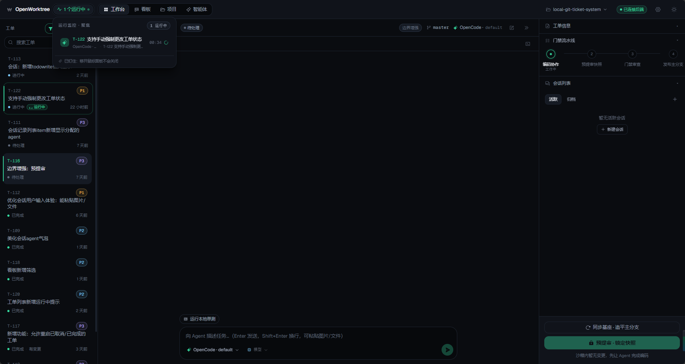
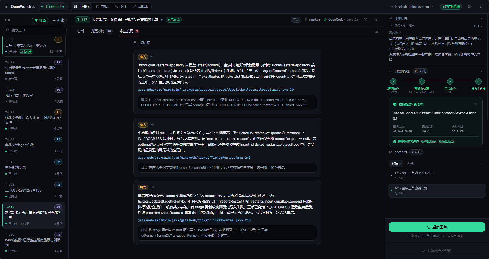
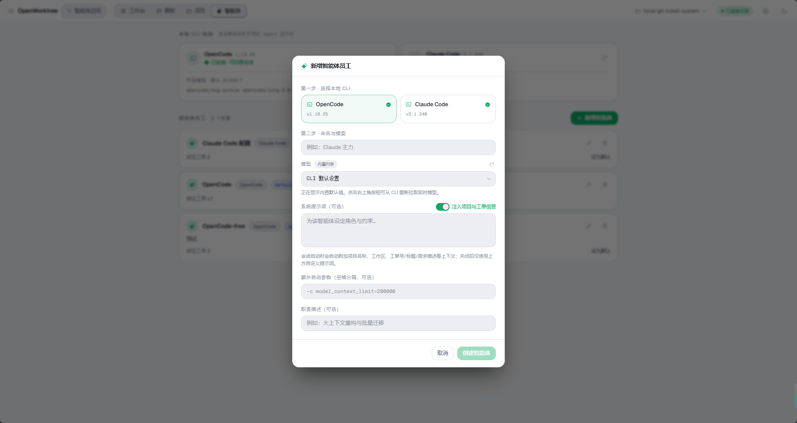

<p align="center">
  
</p>

<h1 align="center">OpenWorktree</h1>

<p align="center">
  工单驱动开发工作台：把需求交给 Agent，在隔离工作区完成开发，经过可追溯审查后安全发布。
</p>

<p align="center">
  <a href="LICENSE"></a>
  
  
  
</p>

<p align="center">
  <a href="#界面展示">界面展示</a> ·
  <a href="#核心流程">核心流程</a> ·
  <a href="#快速开始">快速开始</a> ·
  <a href="release/README.md">发行说明</a>
</p>

OpenWorktree（缩写源自字标 **OW**：圆即字母 O，W 一笔穿环而出）是一个本地优先的工单驱动开发工作台。它把「一张工单 = 一次受控的开发交付」作为最小闭环：工单派给编码智能体，在专属的隔离克隆里写代码；提交前锁定快照并执行门禁审查，发现与判决全程留痕；审查通过后，以可追溯的身份安全发布回目标分支。

## 为什么是 OpenWorktree

AI 编码不应该只留下一个「看起来改好了」的结果。OpenWorktree 把 Agent 的执行范围、代码变更、审查证据和最终发布串在同一张工单里，让开发者可以在不污染主仓库的前提下快速试错，并在发布前回答三个问题：改了什么、为什么能过、谁批准了发布。

## 界面展示

以下截图来自实际工作台，图片保留在 [`doc/`](doc/) 目录中。使用 HTML 表格单元格作为边框容器，在 GitHub、Gitee 等 Markdown 渲染器中都能保持清晰的图片分组。

<table>
  <tr>
    <td align="center" style="border:1px solid #30363d; border-radius:10px; padding:8px;">
      
      <br><sub><b>工单看板</b> · 六泳道拖拽流转，状态与优先级一眼可见</sub>
    </td>
    <td align="center" style="border:1px solid #30363d; border-radius:10px; padding:8px;">
      
      <br><sub><b>会话工作台</b> · Agent 流式执行、运行监控与隔离终端</sub>
    </td>
  </tr>
  <tr>
    <td align="center" style="border:1px solid #30363d; border-radius:10px; padding:8px;">
      
      <br><sub><b>任务清单</b> · 从 Agent 上下文中提取进度，执行状态随会话更新</sub>
    </td>
    <td align="center" style="border:1px solid #30363d; border-radius:10px; padding:8px;">
      
      <br><sub><b>变更对比</b> · 按文件查看差异，发布前确认快照内容</sub>
    </td>
  </tr>
  <tr>
    <td align="center" style="border:1px solid #30363d; border-radius:10px; padding:8px;">
      
      <br><sub><b>审查发现</b> · 展示阻断、警告与建议，并保留修复依据</sub>
    </td>
    <td align="center" style="border:1px solid #30363d; border-radius:10px; padding:8px;">
      
      <br><sub><b>隔离终端</b> · 直接进入工单克隆目录，终端进程可保活</sub>
    </td>
  </tr>
  <tr>
    <td align="center" style="border:1px solid #30363d; border-radius:10px; padding:8px;">
      
      <br><sub><b>智能体配置</b> · 接入 OpenCode、Claude Code 与自定义 Provider</sub>
    </td>
    <td align="center" style="border:1px solid #30363d; border-radius:10px; padding:8px;">
      
      <br><sub><b>项目历史</b> · 分支、提交与工单发布关系集中查看</sub>
    </td>
  </tr>
</table>

## 核心流程

```text
创建工单 → Agent 在隔离 worktree 编码 → 预提审锁定快照
        → 门禁审查产出发现 → 修复并再次审查 → 授权发布到目标分支
```

### 1. 建立上下文

在看板创建工单，填写需求、优先级、标签和目标分支；为工单选择 CLI 智能体、模型、推理强度以及可选的系统提示词。工单上下文会随会话注入，减少 Agent 在不同工具之间来回拼接信息的成本。

### 2. 隔离执行

每张工单使用独立的 Git worktree / 克隆目录。Agent 可以流式回显文本、编辑文件、运行命令和持续更新任务清单；需要人工介入时，会话会明确提示结束状态或待决询问。主仓库不直接承受 Agent 的中间改动。

### 3. 快照与审查

预提审会锁定当前变更快照，门禁审查基于这份不可变输入生成发现与判决：`BLOCKER` 用于阻断，`WARNING` 用于提醒风险，`SUGGESTION` 用于改进建议。审查、修复、二轮结果和操作人都写入审计记录（`audit.jsonl`）。

### 4. 授权发布

只有通过门禁并获得授权的工单才能发布。发布提交可以固定为系统身份，也可以使用本机 Git 作者信息；提交时间使用真实时间，便于在项目历史中追溯工单与代码的对应关系。

## 核心特性

- **工单看板**：六泳道看板，拖拽即流转；门禁泳道会执行对应的预提审、审查和发布操作。
- **隔离工作区**：每张工单独立克隆，主仓库保持干净，多个任务可以并行推进。
- **会话工作台**：接入 Claude headless、OpenCode serve 等 CLI 智能体，支持流式回显、模型与推理强度切换。
- **运行监控**：集中查看正在运行的 Agent、会话结束状态和待决询问，避免后台任务无声退出。
- **任务随行**：从会话中的 `todowrite` 事件同步任务进度，打开或切换会话时仍能看到工作状态。
- **可追溯审查**：快照、差异、发现、判决、修复和审计日志形成完整证据链。
- **安全发布**：发布需要授权，提交身份可控，目标分支与发布结果明确可见。
- **终端工作台**：多标签终端可直连工单克隆目录，支持最小化后台与进程保活。
- **本地优先**：服务绑定回环地址，SQLite、本地 blob 和令牌都存放在运行目录内，拷贝即可迁移。
- **双主题**：暗 / 亮主题随切，OW 徽章配套昼夜过渡动画。

## 架构

Java 17 多模块，依赖单向倒置；Web 层刻意不使用 Spring Boot Web，仅用 JDK `HttpServer` + Javalin 保持轻量。前端是独立的 React 19 + Vite 单页应用。

```text
gate-domain        领域模型与规则（纯 Java，无框架）
gate-ports         端口接口定义
gate-application   用例编排
gate-adapters      外部适配（git CLI、引擎、凭据等）
gate-web           HTTP/SSE 服务（Javalin；API + SPA 静态伺服 + SSE）
gate-bootstrap     装配启动
gate-cli           命令行入口（picocli）
gate-web-ui        前端（React 19 + Vite + Tailwind v4 + zustand + motion + xterm）
```

- **Git 证据**：一律通过真实 `git` 二进制执行，不引入 JGit；审核与发布的证据就是仓库里的真实对象。
- **持久化**：SQLite 由 Flyway 管理迁移，本地 blob 保存运行数据，数据集中在运行目录。
- **安全边界**：仅允许本地回环绑定；Web 请求令牌与 SSE 分别校验；LLM API Key 加密落库。

## 快速开始

### 环境要求

- JDK 17+
- Maven 3.9+
- Node.js 18+ 与 npm
- Git

### 源码开发（Windows）

项目提供一键启动脚本：

```bat
start-local.bat
```

脚本会按需构建后端、启动 `gate-web`（`127.0.0.1:4097`）和 Vite 开发服务器（`127.0.0.1:5173`），然后打开浏览器。后端令牌可从后端窗口的 `GATE_WEB_TOKEN=` 行获取，也会写入 `local-run/gate-home/web-token`。

也可以分步执行：

```bash
# 后端
mvn -DskipTests install
mvn -pl gate-web dependency:copy-dependencies

# 前端
cd gate-web-ui
npm install
npm run dev
```

在「设置中心」配置 LLM Provider 后，即可使用 Agent 会话、预提审、审查和发布流程。API Key 只会以加密形式落库，请勿把本地运行目录或令牌文件提交到版本库。

### Windows 发行包

发行包组装步骤、目录结构、冒烟验证清单和已知问题见 [release/README.md](release/README.md)。发行 zip 是构建产物，不作为源码文件提交；如果使用已有发行包，解压后双击 `start_web_windows.bat`，默认访问 `http://127.0.0.1:18080/`。

## 项目结构与文档

```text
doc/               界面截图、设计与架构资料、品牌资产说明
local-run/         本机运行时配置与数据目录（不入库）
release/           发行打包模板与说明
gate-*/            Java 后端模块
gate-web-ui/       React 前端
start-local.bat    Windows 开发环境一键启动脚本
```

- [发行打包说明](release/README.md)
- [品牌资产说明](doc/local/brand.md)
- [本地文档索引](doc/local/README.md)

## 开发与测试

提交前建议至少运行：

```bash
# 后端编译与测试
mvn test

# 前端类型检查与生产构建
cd gate-web-ui
npm run build
```

涉及 Git、SSE、门禁和发布逻辑时，也请按 [发行说明中的冒烟验证清单](release/README.md#冒烟验证清单) 做一次端到端验证。

## 许可证

本项目以 [GPL-3.0](LICENSE) 协议开源。
