<p align="center">
  
</p>

<h1 align="center">OpenWorktree</h1>

<p align="center">
  A ticket-driven development workbench: hand a requirement to an Agent, let it build in an isolated workspace, and publish safely after a traceable review.
</p>

<p align="center">
  <a href="https://github.com/Saktawdi/OpenWorktree/releases"></a>
  <a href="https://hub.docker.com/r/saktawdi/openworktree"></a>
  <a href="LICENSE"></a>
  
  
  
  
  
</p>
<p align="center">
  <a href="#screenshots">Screenshots</a> ·
  <a href="#core-flow">Core flow</a> ·
  <a href="#mcp-tools">MCP tools</a> ·
  <a href="#plugins">Plugins</a> ·
  <a href="#quick-start">Quick start</a>
</p>
<p align="center">
  <sub>Product name <b>OpenWorktree</b> (abbreviated <b>OW</b>) · the internal review-and-publish core is called <b>Gate</b> — a deliberate product/engine split, not naming confusion.</sub>
  <br>
  <sub><a href="README.md">简体中文</a> · English</sub>
</p>


OpenWorktree is a local-first, ticket-driven development workbench. It treats “one ticket = one controlled delivery” as the smallest closed loop: a ticket is handed to a coding agent that works inside its own isolated clone; before submission the changes are frozen into a snapshot and reviewed by the gate, with findings and verdicts fully recorded; once review passes, the result is published back to the target branch under a traceable identity.

## Screenshots

The screenshots below come from the actual workbench.

<table>
  <tr>
    <td align="center" style="border:1px solid #30363d; border-radius:10px; padding:8px;">
      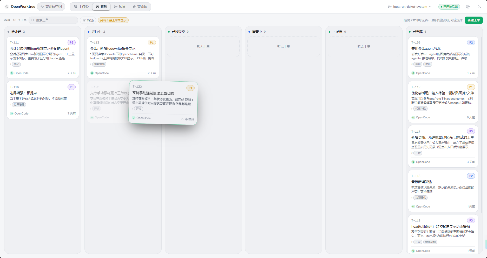
      <br><sub><b>Ticket board</b> · six lanes with drag-to-transition; status and priority at a glance</sub>
    </td>
    <td align="center" style="border:1px solid #30363d; border-radius:10px; padding:8px;">
      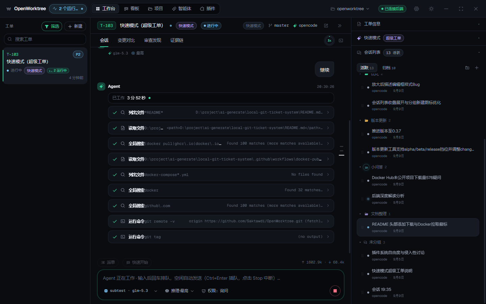
      <br><sub><b>Session workbench</b> · streaming agent output, task progress and grouped session list</sub>
    </td>
  </tr>
  <tr>
    <td align="center" style="border:1px solid #30363d; border-radius:10px; padding:8px;">
      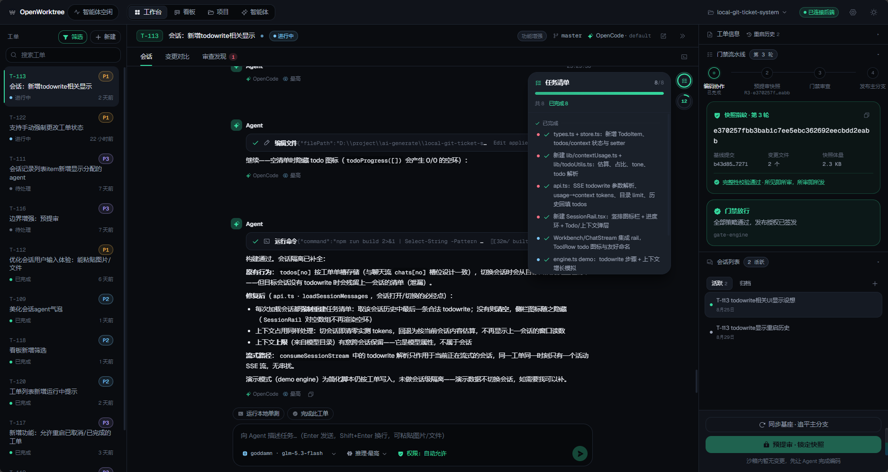
      <br><sub><b>Task list</b> · progress extracted from the agent context and kept in sync with the session</sub>
    </td>
    <td align="center" style="border:1px solid #30363d; border-radius:10px; padding:8px;">
      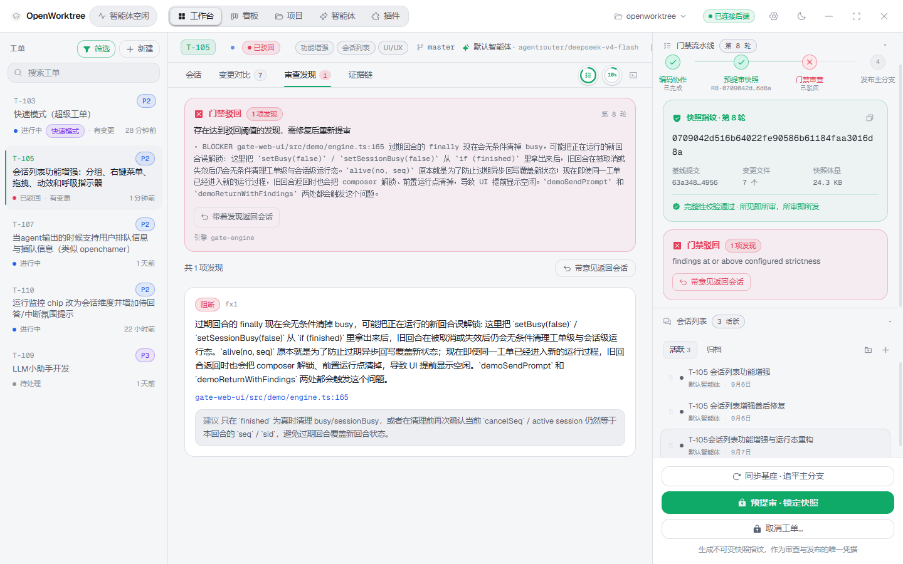
      <br><sub><b>Review findings</b> · gate verdict and finding details, with a one-click return to the session</sub>
    </td>
  </tr>
  <tr>
    <td align="center" style="border:1px solid #30363d; border-radius:10px; padding:8px;">
      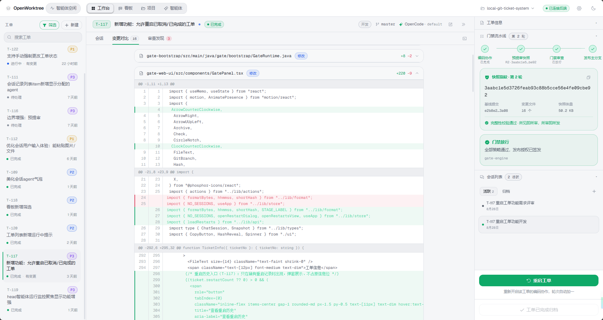
      <br><sub><b>Diff view</b> · inspect the changes file by file before publishing the snapshot</sub>
    </td>
    <td align="center" style="border:1px solid #30363d; border-radius:10px; padding:8px;">
      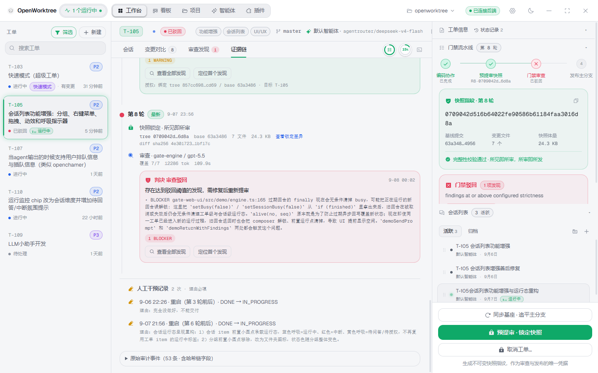
      <br><sub><b>Evidence chain</b> · snapshot fingerprints, review rounds and manual interventions, all on record</sub>
    </td>
  </tr>
  <tr>
    <td align="center" style="border:1px solid #30363d; border-radius:10px; padding:8px;">
      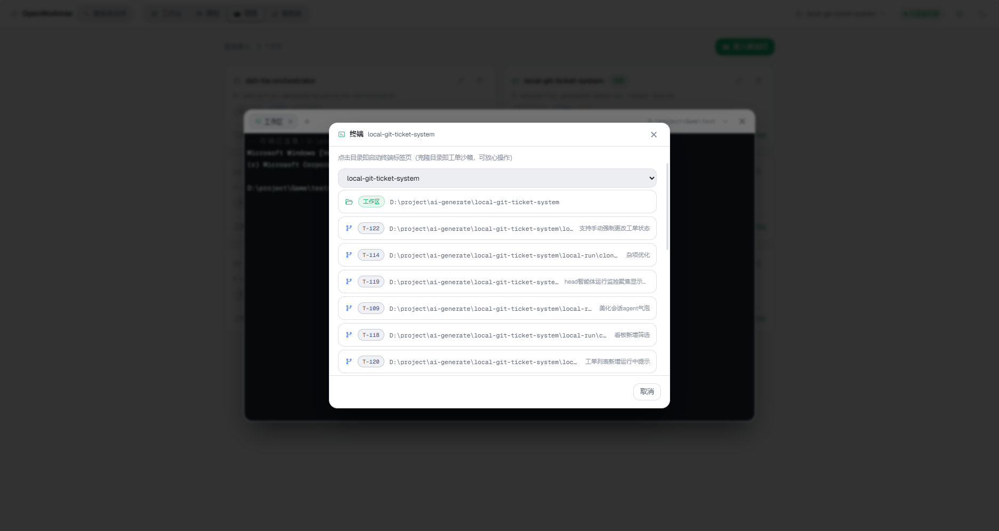
      <br><sub><b>Isolated terminal</b> · open a terminal right inside the ticket clone, processes stay alive</sub>
    </td>
    <td align="center" style="border:1px solid #30363d; border-radius:10px; padding:8px;">
      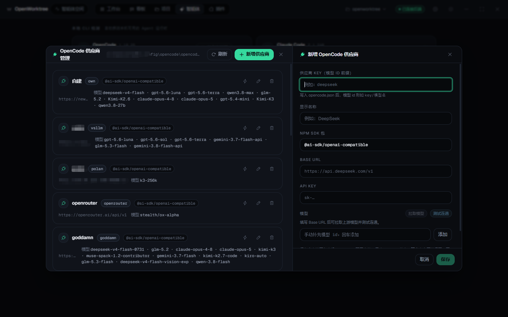
      <br><sub><b>Agent configuration</b> · provider onboarding, model probing and connectivity tests</sub>
    </td>
  </tr>
  <tr>
    <td align="center" style="border:1px solid #30363d; border-radius:10px; padding:8px;">
      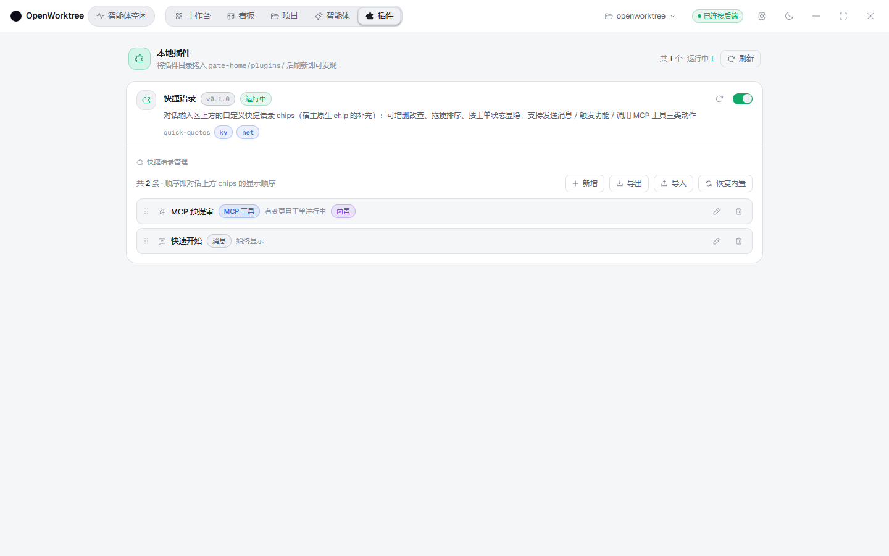
      <br><sub><b>Plugins</b> · install local plugins on the spot to extend conversations and tickets</sub>
    </td>
    <td align="center" style="border:1px solid #30363d; border-radius:10px; padding:8px;">
      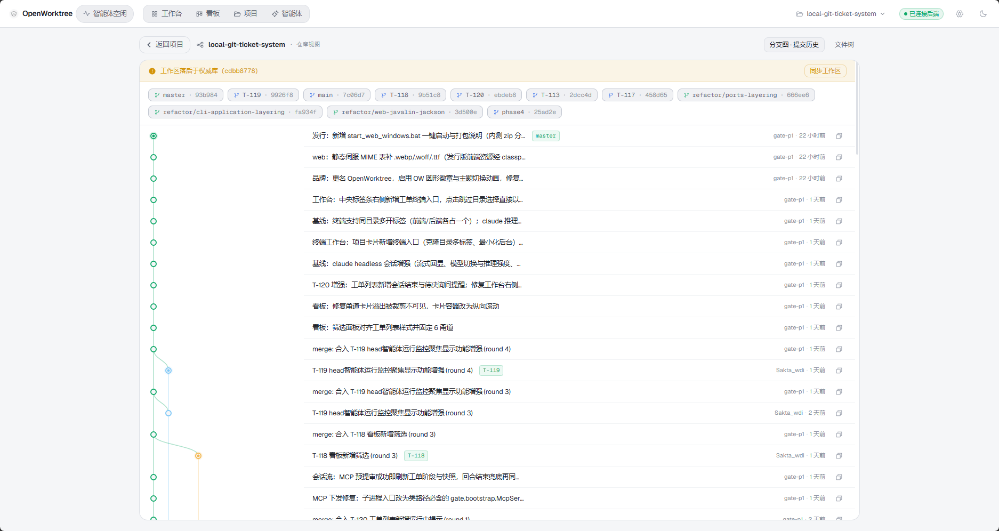
      <br><sub><b>Project history</b> · branches, commits and their relation to ticket publishes in one place</sub>
    </td>
  </tr>
</table>

## Core flow

```text
Create a ticket → Agent codes in an isolated worktree → presubmit freezes a snapshot
                → gate review produces findings → fix and review again → authorized publish to the target branch
```

### 1. Establish context

Create a ticket on the board and fill in the requirement, priority, labels and target branch; pick a CLI agent, model, reasoning effort and an optional system prompt for it. The ticket context is injected into the session, so the agent does not have to reassemble it from scattered tools.

### 2. Isolated execution

Every ticket gets its own Git worktree / clone. The agent can stream text, edit files, run commands and keep a task list up to date; when human input is needed, the session clearly signals its end state or a pending question. The main repository never takes the agent's intermediate changes directly. The agent can also create tickets, submit for review and read review feedback through the built-in MCP tools (see [MCP tools](#mcp-tools)).

### 3. Snapshot and review

Presubmit freezes the current changes into a snapshot, and the gate review produces findings and a verdict from that immutable input: `BLOCKER` blocks, `WARNING` flags risk, `SUGGESTION` proposes improvements. Reviews, fixes, second-round results and the acting operator are all written to the audit log (`audit.jsonl`).

### 4. Authorized publish

Only tickets that passed the gate and obtained an authorization can be published. A publish commit can use a fixed system identity or the machine's Git author; the commit time is the real time, which makes it easy to trace the ticket-to-code relationship in project history.

## MCP tools

OpenWorktree ships an MCP (Model Context Protocol) stdio server that is the only channel between agents and the gate. Wiring is fully automatic: when a session starts, the backend writes `--mcp-config` for Claude Code and `OPENCODE_CONFIG` for OpenCode, and the MCP subprocess is launched with the ticket clone as its working directory — no manual configuration at all.

Tools are split into two permission domains, and credentials are issued per session and bound to a single ticket:

| Tool | Domain | Purpose |
| --- | --- | --- |
| `ticket_create` | Agent | Create a ticket: validate the request, cut a ticket branch from the baseline and prepare an isolated clone, returning the ticket number and clone path. Useful when the agent discovers follow-up work mid-development |
| `ticket_edit` | Agent | Edit a ticket's work-item metadata: title, priority, description, note and labels. Only the fields you pass are touched (omit one to leave it as it is); an empty string (or `[]` for labels) clears an optional field, and JSON `null` counts as omitting it. There is deliberately **no stage parameter** — the ticket's stage belongs to the gate flow (presubmit → review → publish) and human restart/cancel, so an agent has no way to express a state transition. Scope: an agent may edit only the ticket its credential is bound to (`ticket_no` may be omitted, meaning that ticket); naming any other ticket is denied. Human tokens are unrestricted |
| `presubmit_create` | Agent | Presubmit: freeze the current workspace into an immutable snapshot and open a review round. The only state transition an agent can trigger |
| `presubmit_get_diff` | Agent | Read the diff text frozen by a given presubmit round to confirm what is being reviewed |
| `review_result_get` | Agent | Read the review outcome (verdict + structured findings) and fix before resubmitting |
| `sync_base` | Agent | Base sync: fast-forward the ticket clone and its authoritative branch to the latest tip of the main branch; uncommitted changes (including untracked files) are stashed and replayed by default with conflict markers left in the workspace for the agent to resolve, while `allow_dirty:false` skips a dirty clone untouched; refused during review rounds (pre-submitted / in review / ready to publish), for terminal tickets (restart first) and for quick-mode super tickets |
| `session_read` | Agent | Read a session's transcript, read-only: session metadata (ticket, status, model, usage) plus its messages in chronological order (role, text, thinking, tool calls and their results). The newest 20 messages by default (max 100); each carries its absolute index in the full transcript, and passing the returned `next_before_index` back as `before_index` pages towards older messages. Long fields are clipped with an explicit truncation marker and the whole response is size-capped, so page through long sessions. Scope matches `ticket_create`: an agent can read sessions of <b>its own project</b> (a sibling ticket's session is readable, another project's is denied); human tokens are unrestricted |
| `review_run` | Human | Run one review round (built-in engine or manual verdict) and produce findings and a verdict |
| `commit_and_publish` | Human | Commit the reviewed snapshot and publish it to the target branch through the gate |
| `config_show` | Human | Show the effective gate configuration (paths, target ref, engine status) |
| `provider_list` | Human | List configured LLM providers and their cached models |

## Highlights

- **Ticket board**: six-lane board with drag-to-transition; the gate lanes execute the matching presubmit, review and publish actions.
- **Isolated workspaces**: one clone per ticket keeps the main repository clean and lets several tasks run in parallel.
- **Session workbench**: connects CLI agents such as Claude headless and OpenCode serve, with streaming output and model / reasoning-effort switching.
- **MCP toolchain**: agents create tickets, submit for review and read feedback through low-privilege MCP tools; review execution and publish authorization stay in the human domain.
- **Run monitor**: a single place to watch running agents, session end states and pending questions, so background tasks never die silently.
- **Traceable review**: snapshots, diffs, findings, verdicts, fixes and the audit log form a complete evidence chain.
- **Safe publishing**: publishing requires an authorization, the commit identity is controllable, and the target branch and publish result are explicit.
- **Terminal workbench**: multi-tab terminals can attach directly to ticket clones, with minimize-to-background and process keep-alive.
- **Plugin system**: four kinds of contribution points — chat quick actions, selection menu, settings widgets and full-page navigation — with the contract defined solely by the in-repo SDK (see [Plugins](#plugins)).
- **Local first**: the service binds to loopback, and SQLite, local blobs and tokens all live inside the run directory — copy the directory and you have migrated.
- **Dual theme**: dark / light switch instantly, with a matching day-night transition animation for the OW badge.
- **Multilingual UI**: ships with Simplified Chinese and English copy; one click in Settings switches the whole UI (text, time and date formats follow, and the choice is persisted locally). Adding a language only needs one more dictionary — missing keys fall back to the default language instead of showing raw key names.
- **First-run guide**: the first launch opens a seven-step setup wizard (language → connect to the backend → connect a project → agents → LLM settings → board → workbench). It can be skipped in one click and replayed anytime from Settings → Preferences → Getting-started tour.

## Plugins

The host exposes UI contribution points to plugins through slots:

- Contribution interfaces: [packages/plugin-sdk](packages/plugin-sdk/README.md) (capability table, slot list, event bus, lifecycle and freeze semantics)
- Starting point: [plugin-template](plugin-template/README.md) (lifecycle, shared React primitives, trust model and FAQ)
- Example: [plugins/quick-quotes](plugins/quick-quotes/README.md) (quick quotes plugin)

## Architecture

Java 17, multi-module, with one-directional inverted dependencies; the web layer deliberately avoids Spring Boot and uses only Javalin (Jetty) to stay lightweight. The frontend is a standalone React 19 + Vite single-page app.

```text
gate-domain        domain model and rules (plain Java, no framework)
gate-ports         port interfaces
gate-application   use-case orchestration
gate-adapters      external adapters (git CLI, engine, MCP, credentials, ...)
gate-web           HTTP/SSE service (Javalin; API + SPA static serving + SSE)
gate-bootstrap     wiring and startup
gate-cli           command-line entry point (picocli)
gate-web-ui        frontend (React 19 + Vite + Tailwind v4 + zustand + motion + xterm)
```

- **Git evidence**: everything goes through the real `git` binary — no JGit; the evidence for review and publish is the real objects in the repository.
- **Persistence**: SQLite with Flyway-managed migrations, plus local blobs for runtime data; all data lives in the run directory.
- **Security boundary**: loopback-only binding; web request token and SSE are validated separately; LLM API keys are encrypted at rest.

<p align="center">
  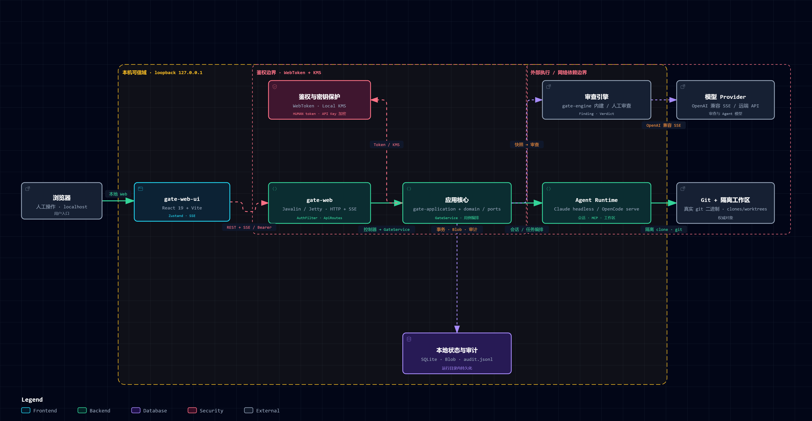
  <br><sub><b>System architecture</b> · data flow and security boundary from the browser to the isolated workspaces</sub>
</p>

## Quick start

### Option 1: Windows desktop app and single-file native build (recommended, double-click to run)

Same backend, two shapes: the desktop app has an installer and a resident system tray (it embeds exactly the single-file native binary below), the native build needs no installation and starts with one command. Pick the desktop app for daily use; go straight for the native build on servers / no-install setups.

#### Windows desktop app

Installers are published on [GitHub Releases](https://github.com/Saktawdi/OpenWorktree/releases): download the latest `OpenWorktree_<version>_x64-setup.exe` and double-click to install — it signs in automatically on start, so you never paste a token by hand.

The only prerequisite is `git` on the machine (install the matching CLI, such as opencode or Claude Code, when you actually run agent sessions).

- Installers are built by CI (attached to the Release when a `v*` tag is pushed; you can also build it yourself following [`desktop/README.md`](desktop/README.md));
- Data goes to `data\` under the install directory by default (ticket clones follow the install drive). On uninstall you can keep it (moved to `%APPDATA%\OpenWorktree`) or delete it;
- The backend embedded in the desktop shell is exactly the single-file native binary below, so behavior matches the from-source option.

#### Single-file native build (Linux / Windows, no Java / Node required)

A single-file binary produced by GraalVM native-image — **backend and frontend in one**: the SPA is embedded into the binary at build time, so running it gives you a complete service with no separate frontend. No Java, Maven or Node required — double-click or one command and it is up.

- The only prerequisite is `git` on the machine (install the matching CLI, such as opencode or Claude Code, when you run agent sessions);
- **Linux glibc requirement**: the binary is built on a recent distribution and needs the `GLIBC_2.32` / `GLIBC_2.34` symbols — **Ubuntu 21.10+ / Debian 12+ / RHEL 9+** or equivalent (older systems such as CentOS 7 fail with `GLIBC_2.34 not found`); on older systems use the Docker option (Option 2) or build it yourself on the target platform;
- **Windows on ARM**: there is no native ARM64 build (upstream GraalVM ships no Windows arm64 toolchain); on ARM devices just use the x64 binary — Windows runs x64 apps through its built-in emulation layer;
- Binaries are published on [GitHub Releases](https://github.com/Saktawdi/OpenWorktree/releases) (a `v*` tag attaches `ow-linux-x86_64` / `ow-linux-arm64` / `ow-windows-x86_64` automatically); day-to-day master builds are available as the `ow-native-Linux` / `ow-native-Linux-arm64` / `ow-native-Windows` Actions artifacts (kept for 14 days);
- Start it (run it in the directory where you want the data to live):

```bash
# Linux (x86_64)
./ow-linux-x86_64

# Linux (ARM64)
./ow-linux-arm64

# Windows (PowerShell; the file runs even without an .exe suffix)
.\ow-windows-x86_64
```

- The first start generates `local-run/gate.toml` (loopback `127.0.0.1:18080` by default) and `gate-home/` (database, token, mirror repos, ticket clones); the layout is identical to the from-source option, so copying the whole directory migrates everything. Use `--config your-gate.toml` to change the port etc.;
- When you see `GATE_WEB_TOKEN=...` and `listening on http://127.0.0.1:18080/` in the log, it is up: open <http://127.0.0.1:18080> in a browser; the token is on that log line or in `local-run/gate-home/web-token`.

### Option 2: Docker (fallback — not recommended for cloud use)

> The image is still published, but **not recommended for everyday use — and even less for cloud deployment**: the container keeps a JDK + nginx + opencode resident, so its memory footprint is noticeably higher than the native options. It only makes sense for a quick trial or an evaluation box with no local environment.

Multi-arch images (amd64/arm64) are published on Docker Hub: [`saktawdi/openworktree`](https://hub.docker.com/r/saktawdi/openworktree). No need to clone the repository — save the following as `compose.yaml` (in any directory):

```yaml
services:
  openworktree:
    image: saktawdi/openworktree:latest
    ports:
      - "8080:8080"                      # change the left-hand number on the host, e.g. 9000:8080
    environment:
      # When accessing via LAN / reverse proxy, add the entry Host to the allowlist (comma-separated):
      # OW_ALLOWED_ORIGINS: 192.168.1.10,worktree.internal
      OW_ALLOWED_ORIGINS: ""
    volumes:
      - openworktree-data:/data         # config, SQLite, token and ticket clones all live here
    restart: unless-stopped
volumes:
  openworktree-data:
```

```bash
docker compose up -d                                     # pull and start
docker compose logs openworktree | grep GATE_WEB_TOKEN   # copy the login token → sign in on the page
```

Open <http://localhost:8080>.

Notes:

- **Image contents**: JDK 17 + git + nginx + the built frontend + **opencode (the project's default agent CLI, bundled, so agent sessions work out of the box)**. Tickets, review, publish and the isolated terminal need nothing else; Claude Code can be added as shown below.
- **Same security boundary**: the backend can only bind to loopback inside the container (fail-closed in `GateConfig.WebConfig`) and only nginx is exposed; the `allowed_origins` host allowlist still applies — remember to set `OW_ALLOWED_ORIGINS` for LAN access.
- **Data**: `/data/gate.toml` is generated on first start; run `docker compose restart` after changing the config.
- **Gate initialization (optional, for tickets not attached to a project)**: `docker compose exec openworktree java -cp "/app/lib/*" gate.cli.GateApp init -c /data/gate.toml`.

To add Claude Code (or another agent CLI), inherit the image in one line and use your own compose:

```dockerfile
FROM saktawdi/openworktree:latest
RUN npm install -g @anthropic-ai/claude-code && npm cache clean --force
```

To build from source (for development): run `docker compose up -d --build` at the repository root; the build-arg `INSTALL_CLAUDE=true` bakes Claude Code into the image.

### Option 3: Local development (from source)

#### Requirements

| Tool | Version | Check |
| --- | --- | --- |
| JDK | 17+ | `java -version` |
| Maven | 3.9+ | `mvn -v` |
| Node.js + npm | 18+ | `node -v` |
| Git | any recent version | `git --version` |

<details>
<summary><b>No environment yet? One-line install per OS</b></summary>
**Windows** (winget):

```powershell
winget install Microsoft.OpenJDK.17 Apache.Maven OpenJS.NodeJS.LTS Git.Git
```

Without winget, download and install from Adoptium (JDK 17), Maven, nodejs.org and the Git website.

**Ubuntu / Debian**:

```bash
sudo apt install openjdk-17-jdk maven git
# Node in older repos is too old; install Node 20 with nvm:
curl -o- https://raw.githubusercontent.com/nvm-sh/nvm/v0.40.3/install.sh | bash
nvm install 20
```

**CentOS / Fedora / RHEL**:

```bash
sudo dnf install java-17-openjdk-devel maven git   # Node 18+ likewise recommended via nvm
```

**macOS** (Homebrew):

```bash
brew install openjdk@17 maven node git
```

</details>

#### Step 0: Clone and build

```bash
git clone https://github.com/Saktawdi/OpenWorktree.git
cd OpenWorktree

# Backend build (skip the second command if you run main from IDEA)
mvn -DskipTests install
mvn -pl gate-web dependency:copy-dependencies

# Frontend dependencies
cd gate-web-ui && npm install && cd ..
```

#### Step 1: Start the backend (either way)

**Way A: terminal** (keep the terminal open; errors show up here)

```powershell
# Windows
java -Dfile.encoding=UTF-8 -cp "gate-web/target/classes;gate-web/target/dependency/*" gate.web.GateWebApp
```

```bash
# Linux / macOS
java -Dfile.encoding=UTF-8 -cp "gate-web/target/classes:gate-web/target/dependency/*" gate.web.GateWebApp
```

**Way B: an IDE such as IDEA**

Run the main class of `gate.web.GateWebApp` directly — `dependency:copy-dependencies` is not needed. Run/Debug configuration:

| Setting | Value |
| --- | --- |
| Main class | `gate.web.GateWebApp` |
| Working directory | repository root |
| Program arguments | leave empty |
| VM options | `-Dfile.encoding=UTF-8` (recommended on Windows to avoid garbled Chinese logs) |
| JRE | 17+ |

VS Code / Cursor use the equivalent launch.json configuration (`mainClass: gate.web.GateWebApp`, `cwd` pointing at the repository root).

The first start generates `local-run/gate.toml` (loopback 127.0.0.1:18080) and creates the database, token and other runtime data automatically. Ports, review engine and the rest are then changed from the Settings center (written back to that file) — no hand editing. When you see `GATE_WEB_TOKEN=...` and `listening on http://127.0.0.1:18080/`, it is up.

#### Step 2: Start the frontend

In a second terminal:

```bash
cd gate-web-ui
npm run dev
```

Open <http://127.0.0.1:5173> in a browser (Vite already proxies the API to the backend on 18080).

If you also want tickets **not attached to a project** to work, run `gate init` once to initialize the gate-level default mirror repository (idempotent, safe to repeat):

```bash
mvn -pl gate-cli dependency:copy-dependencies
# On Windows use ; as the classpath separator, on Linux/macOS use :
java -cp "gate-cli/target/classes:gate-cli/target/dependency/*" gate.cli.GateApp init -c local-run/gate.toml
```

### FAQ

- **The backend will not start**: usually one of the two build commands in step 1 was skipped; the first line of the error in the startup terminal tells you what is missing.
- **Tokens, the database and everything else land in `local-run/`**: the whole directory is git-ignored, and copying it migrates all data.

## Roadmap

Near-term direction:

- **Keep polishing the experience**: the first-run guide, loading skeletons and streaming performance work have landed one after another; we keep iterating on real usage feedback.
- **Per-ticket token usage and cost page**: per-ticket aggregation (split by round / model) and cost estimation are still to come.
- **Cross-ticket audit browser**: the per-ticket evidence chain is available (snapshots, findings, verdicts, manual interventions on record); browsing and searching the audit log across tickets is still to come.
- **More plugins and continued plugin-system work**: the plugin SDK, template and the quick-quotes example are in place; next come plugins for common scenarios and a smoother install/distribution story.
- **More CLI agents**: OpenCode and Claude Code are supported today; more CLI runtimes are on the way.
- **Cloud team edition**: multi-tenancy and collaboration (the single-machine Docker image is already on Docker Hub, see [Quick start](#quick-start)).

## License

This project is open source under [Apache-2.0](LICENSE).
