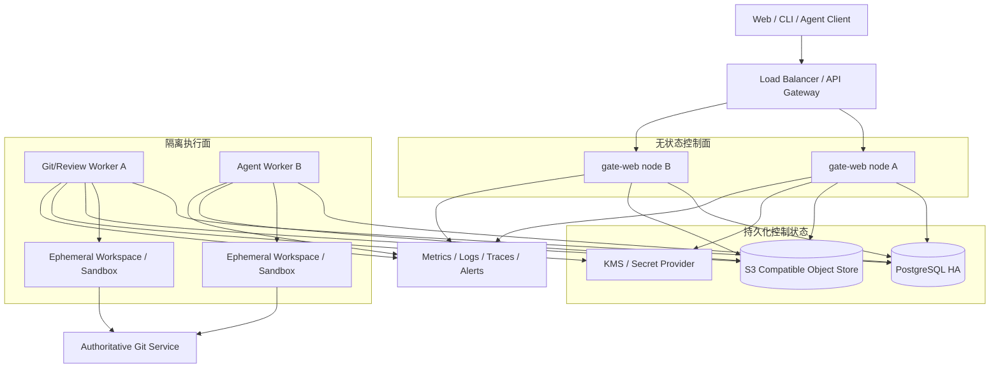
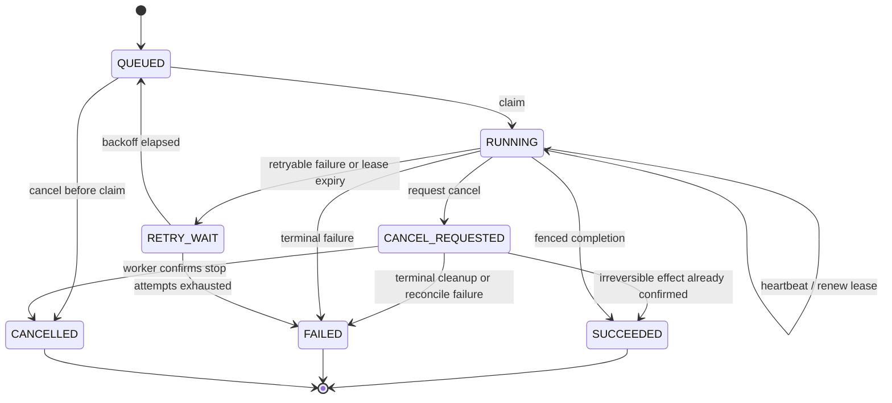
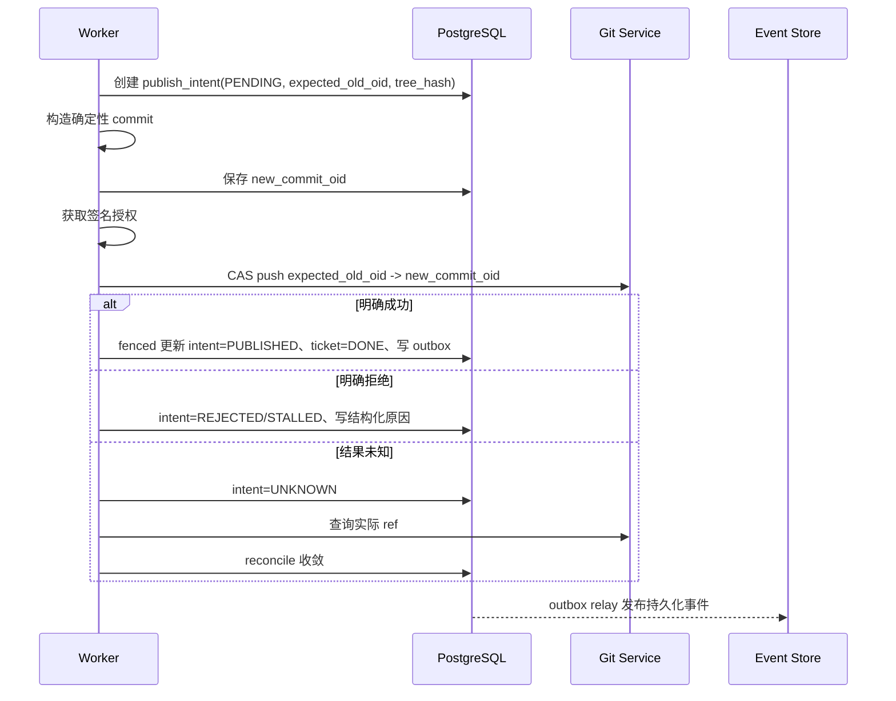

# Gate 企业级生产后端架构规范

状态：已接受为重构实施基线（Accepted）

批准记录：项目负责人确认 + Codex（项目负责人授权 L4），2026-08-19；见 [`l4-approval-record.md`](l4-approval-record.md)

生产状态：未准入；必须继续满足各 Phase 退出条件与第 19 节生产总验收

适用范围：Gate 后端、Web API、CLI、Git/Agent 执行节点、任务系统及其生产基础设施  
最后更新：2026-08-19

## 1. 文档目的与规范用语

本规范定义 Gate 从本地单机系统演进为企业级、高可用、可水平扩展后端所必须遵守的架构边界、正确性协议、运行指标和验收门槛。

它不把“采用 PostgreSQL、Redis、S3 或虚拟线程”等技术选型本身视为生产能力。只有当系统在重复请求、节点暂停、租约过期、进程崩溃、网络分区、依赖切换和滚动升级期间仍能保持业务不变量时，相关能力才视为完成。

本文使用以下规范用语：

- **必须（MUST）**：违反即不允许进入生产。
- **禁止（MUST NOT）**：任何实现均不得采用。
- **应该（SHOULD）**：默认要求；偏离时必须通过 ADR 说明原因和补偿措施。
- **可以（MAY）**：允许按部署形态选择。

代码、自动化测试、数据库迁移和已接受 ADR 是事实来源。若它们相互冲突，必须停止发布并完成一致性修复，不得默认为其中任一方正确。

### 1.1 文档权威关系

- 本文是后端目标架构和生产验收的唯一生效规范；`Accepted` 表示决策基线已获批准，不表示实现已完成或生产已准入。
- [`../product/product-spec.md`](../product/product-spec.md) 描述目标体验，不得覆盖本文的安全、并发和可用性约束。
- ADR 记录重大决策的理由和替代方案。ADR 与本文冲突时，合并前必须同步修订本文，禁止形成两个同时生效的架构事实来源。
- [`../archive/`](../archive/) 只保存仍被代码或测试引用的历史证据，不具有规范效力。
- 当前实现与目标规范之间的差距必须进入 Phase 清单、Issue 或测试，不得通过降低本文措辞掩盖。

## 2. 目标、非目标与部署模式

### 2.1 目标

Gate 生产架构必须满足：

1. Web/API 节点无状态，可滚动扩缩容和跨节点接入。
2. Git、Review、Publish、Agent Session 等长任务均通过持久化任务系统调度，不依赖请求线程存活。
3. 所有可重试业务动作具有明确幂等键；所有 Worker 接管具有租约和 fencing token。
4. Git 目标 ref 通过基于旧 OID 的原子比较交换推进，分布式锁只用于降低竞争，不承担最终正确性。
5. 业务状态、任务状态和可回放事件之间具备明确的事务一致性协议。
6. 节点宕机、重复提交、超时、部分成功和消息重复不会造成重复发布、错误放行或不可恢复状态。
7. 系统具备容量上限、背压、限流、降级、可观测性、备份恢复和滚动升级能力。
8. local 与 production 使用相同业务端口和契约测试，基础设施差异不得渗入领域和应用层。

### 2.2 非目标

- 不保证任意 Agent 子进程能够从指令中间位置透明恢复。
- 不把 Git worktree 视为安全沙箱；安全隔离由独立执行环境负责。
- 不承诺 exactly-once 的外部执行。系统采用 at-least-once 调度，并通过幂等、CAS、fencing 和 reconcile 达成 exactly-once effect。
- 不允许仅通过扩大线程池、数据库连接池或队列容量解决过载。

### 2.3 部署模式

| 模式 | 用途 | 数据库 | Git/工作区 | 锁与任务 | 可用性定位 |
| --- | --- | --- | --- | --- | --- |
| `local` | 单人开发、离线使用、测试 | SQLite WAL | 本地 auth repo + worktree | 文件锁 + 有界本地 Worker | 不承担多节点 HA |
| `team` | 小团队单集群 | PostgreSQL | 权威 Git 服务 + 临时 Worker 工作区 | PostgreSQL 租约；可选 advisory lock | 支持多 Web、多 Worker |
| `enterprise` | 多租户、审计与灾备 | PostgreSQL HA | 高可用 Git 服务 + 隔离执行节点 | 持久化任务、fencing、分布式限流 | 支持滚动升级和灾备 |

生产环境禁止通过 NFS/CIFS 共享本地 SQLite、文件锁或工作区来模拟多节点。

### 2.4 当前状态与目标状态

当前仓库仍处于从 `local` 向 `team` 能力迁移的阶段，已有模块化 Maven 工程、SQLite、文件锁、本地 Git、发布意图和部分有界执行能力，但尚不具备本文定义的多节点生产能力。

本文中带有“必须”的条款是目标约束，不等于已经实现。实现状态只按第 17 节 Phase 退出条件认定；未满足退出条件的能力必须在 UI、API 和部署说明中标记为不可用于生产。

### 2.5 术语

| 术语 | 含义 |
| --- | --- |
| 控制面 | 接收请求、鉴权、登记幂等、创建任务和提供状态/事件查询的无状态 Web/API 节点 |
| 执行面 | 领取持久化任务并运行 Git、Review 或 Agent 工作负载的 Worker 与隔离环境 |
| 权威事实 | 能决定最终业务状态的外部或持久化状态，例如 PostgreSQL 记录和权威 Git ref |
| Intent | 在不可逆外部动作前写入的可恢复意图记录 |
| Fence token | 每次任务所有权转移时递增、用于拒绝旧 Worker 写入的令牌 |
| Exactly-once effect | 调度和调用可以重复，但最终业务副作用通过幂等、CAS、fencing 和 reconcile 至多生效一次 |
| Reconcile | 根据外部权威事实收敛数据库状态的恢复过程，不是无条件重试 |

## 3. 核心业务不变量

以下不变量必须由数据库约束、类型系统、服务端 Git 检查和自动化故障测试共同保证：

### I1：所审即所发

发布的 `new_commit_oid` 所引用的 tree 必须等于审核通过的 `tree_hash`；授权同时绑定目标仓库、目标 ref、预期旧 OID、审核轮次和策略版本。

### I2：目标 ref 只允许原子推进

发布必须满足：

```text
actual_old_oid == authorization.expected_old_oid
new_commit.parent == authorization.expected_old_oid
new_commit.tree == authorization.tree_hash
```

任一条件不满足时必须拒绝发布并要求重新 presubmit/review。禁止“先读取 ref，再无条件 push”的检查后执行模式。

### I3：一次业务动作只产生一个可观察结果

相同租户、项目、动作类型和幂等键重复提交时，只能获得同一个任务或同一个终态结果。相同幂等键但请求摘要不同，必须返回 `IDEMPOTENCY_CONFLICT`。

### I4：过期 Worker 不能提交结果

任何任务进度、终态写入和受保护外部副作用都必须携带当前 `attempt` 与 `fence_token`。租约被接管后，旧 Worker 的写入必须被拒绝。

### I5：数据库不伪造外部事实

数据库中的 `PUBLISHED`、对象已存储、Agent 已终止等状态必须能由 Git、对象存储或执行环境事实验证。发生部分成功时，由 reconcile 收敛，禁止通过人工直接修改终态掩盖故障。

### I6：终态单向

任务进入 `SUCCEEDED`、`FAILED` 或 `CANCELLED` 后不得回到运行态。重试必须创建新 attempt，并保留完整历史。

### I7：Fail-Closed

审核证据缺失、引擎超时、授权过期、策略版本未知、完整性校验失败或依赖状态不可确认时，均不得发布。

## 4. 目标运行拓扑



### 4.1 控制面

Web 节点只负责：

- 身份认证、授权、租户/项目边界校验。
- 请求验证、幂等登记、短事务读写。
- 创建任务并返回 `202 Accepted`。
- 从持久化事件表向客户端提供 SSE 回放和实时尾随。

Web 节点禁止：

- 在请求线程中等待 Git、Review Engine 或 Agent 子进程完成。
- 保存跨请求必须存在的 Listener、Session 或任务状态。
- 把本地磁盘作为跨节点事实来源。

### 4.2 执行面

Worker 负责长任务执行。每个 Worker 必须发布以下能力和容量：

- 支持的任务类型、操作系统和工具版本。
- 可用 CPU、内存、磁盘、并发槽位和沙箱能力。
- 最后心跳、当前任务数和 draining 状态。

调度器根据任务类型、项目、运行时要求和容量选择 Worker。需要本地连续状态的 Agent 会话可以使用节点亲和性，但亲和性不是持久化保证；节点失效后必须按任务类型选择“重建并重试”或“终止并由用户重新开始”。

### 4.3 Git 权威位置

`team` 和 `enterprise` 模式必须使用独立的权威 Git 服务或等价高可用仓库服务。Worker 本地 clone/worktree 是可丢弃缓存，不是权威事实。

工作区必须可由以下持久化信息重建：

- repository/project 标识和远端地址。
- base commit OID 和 target ref。
- presubmit tree/diff 或不可变源码快照。
- 工具链版本、Agent 配置和必要的 Secret 引用。

## 5. 模块与依赖边界

```text
gate-domain <- gate-ports <- gate-application
      ^            ^              ^
      |            |              |
      +------ gate-adapters       |
                   ^              |
                   +--- gate-bootstrap
                              ^
                              |
                     gate-web / gate-cli
```

箭头 `A <- B` 表示 B 可以依赖 A。图只表达编译期依赖，不表示运行时调用方向。

- `gate-domain`：纯领域模型与状态机，仅依赖 `java.base`。
- `gate-ports`：业务所需能力，不暴露 JDBC、HTTP、JSON Map、文件路径或供应商 SDK 类型。
- `gate-application`：按业务能力组织用例和事务边界，不创建基础设施实现。
- `gate-adapters`：PostgreSQL/SQLite、Git、对象存储、Agent、审计、锁和遥测实现。
- `gate-bootstrap`：唯一组合根，负责 profile、配置校验、生命周期和优雅关闭。
- `gate-web`、`gate-cli`：驱动适配器，只调用应用用例。

允许的直接编译依赖如下：

| 模块 | 允许直接依赖 | 禁止事项 |
| --- | --- | --- |
| `gate-domain` | `java.base` | 框架、文件、网络、进程、数据库和序列化依赖 |
| `gate-ports` | `gate-domain` | 依赖 application、adapter 或协议 DTO |
| `gate-application` | `gate-domain`、`gate-ports` | 创建 adapter、依赖 Spring/JDBC/HTTP/Git CLI |
| `gate-adapters` | `gate-domain`、`gate-ports` | 依赖 Web/CLI；新增对 application 的依赖 |
| `gate-bootstrap` | domain、ports、application、adapters | 暴露 Spring/JDBC 等框架类型给驱动层 |
| `gate-web`、`gate-cli` | bootstrap、application API，以及必要的 domain DTO | 直接创建或依赖 adapters 实现 |

当前代码中不符合该矩阵的历史依赖属于 Phase 1 迁移债务。不得因为现有代码已经存在而把例外固化为目标架构；新增代码必须立即遵守，存量例外通过 ArchUnit 基线逐项清零。

应用层按以下能力拆分，完整注册表见 [`capability-registry.md`](capability-registry.md)：

- `project`
- `ticket`
- `presubmit`
- `review`
- `publish`
- `session`
- `task`
- `event`
- `provider`
- `security`
- `metrics`
- `status`

每个能力必须暴露窄接口。跨能力调用依赖应用接口或领域事件，禁止直接访问另一能力的 Repository 实现。

`gate-bootstrap` 可以依赖 Spring 等装配技术，但其公开入口必须是项目自有的运行时/生命周期类型，不得返回 `JdbcTemplate`、`ApplicationContext` 等框架对象。ArchUnit 规则必须与该边界保持一致。

## 6. 持久化任务协议

### 6.1 任务状态机



### 6.2 最小任务模型

生产任务表至少包含：

```text
id
tenant_id
project_id
type
payload_ref / payload_digest
idempotency_key
request_digest
status
priority
available_at
lease_owner
lease_until
attempt
max_attempts
fence_token
timeout_at
cancel_requested_at
result_ref
error_code
created_at / started_at / finished_at / updated_at
```

必须建立唯一约束：

```text
UNIQUE(tenant_id, project_id, type, idempotency_key)
```

幂等记录的保留期必须覆盖客户端最大重试窗口、任务最大运行时间和灾难恢复窗口。记录过期后复用同一 key 必须被视为新请求；在保留期内，相同 key 的 `request_digest` 不同必须返回冲突，禁止静默复用旧结果。

### 6.3 创建与领取

任务创建、幂等登记和首个 `task.created` 事件必须位于同一个数据库事务中。

Worker 领取必须是单条原子数据库操作。PostgreSQL 实现应使用 `FOR UPDATE SKIP LOCKED` 或条件 `UPDATE ... RETURNING`，并同时：

- 将状态改为 `RUNNING`。
- 增加 `attempt`。
- 生成单调递增的 `fence_token`。
- 设置 `lease_owner` 和 `lease_until`。

不得先查询候选任务，再通过无条件更新声明所有权。

所有租约时间比较必须使用 PostgreSQL 服务器时间，禁止使用 Worker 本地时钟决定租约是否过期。领取顺序必须有确定规则，例如 `priority DESC, available_at ASC, id ASC`；长期低优先级任务必须通过 aging 或配额避免永久饥饿。

### 6.4 续租与接管

- Worker 必须按租约时长的 1/3 至 1/2 周期续租。
- 续租和完成更新必须匹配 `id + lease_owner + attempt + fence_token + non_terminal_status`。
- 租约过期不等于原进程已经停止；接管者必须假定旧 Worker 仍可能继续运行。
- 旧 fence 的数据库写入必须更新 0 行，并记录 `stale_worker_write_rejected` 指标。
- 对无法 fencing 的外部副作用，必须依赖外部系统 CAS 或幂等操作键。

租约过期任务由独立 reaper 使用数据库时间和条件更新转入 `RETRY_WAIT` 或 `FAILED`。普通 Worker 不得自行宣布其他 owner 的租约失效。数据库故障切换后，Worker 必须重新连接并使用当前 fence 完成一次续租；续租失败即停止提交结果并进入清理流程。

### 6.5 重试分类

错误必须结构化分类：

- `RETRYABLE_TRANSIENT`：网络抖动、暂时依赖不可用、并发冲突。
- `RETRYABLE_AFTER_REBUILD`：工作区损坏、Worker 丢失，需要重建环境。
- `NON_RETRYABLE_INPUT`：参数、权限、配置或策略错误。
- `NON_RETRYABLE_INTEGRITY`：TreeHash、签名、CAS 或审计完整性错误。
- `UNKNOWN_OUTCOME`：外部动作可能成功，需要先 reconcile，禁止直接重试。

重试必须使用指数退避和随机抖动。发布、扣费、远端创建资源等动作遇到 `UNKNOWN_OUTCOME` 时必须先查询外部事实。

每个任务类型必须在注册表中声明：最大运行时间、最大 attempts、退避参数、是否可重放、幂等作用域、外部结果查询方式和允许自动重试的错误集合。没有登记这些信息的任务类型不得进入生产 Worker。

### 6.6 取消

取消是协作式协议，不等价于中断线程：

1. API 写入 `CANCEL_REQUESTED`。
2. Worker 定期检查取消标志并终止子进程树。
3. Worker 清理工作区、端口和临时凭据。
4. 使用当前 fence 写入 `CANCELLED`。

如果不可逆外部动作已经发生，任务必须进入 reconcile，而不是伪装成 `CANCELLED`。

取消和完成并发时使用数据库 CAS 决胜：外部副作用尚未发生且取消先提交时写入 `CANCELLED`；外部副作用已经由权威系统确认时收敛为 `SUCCEEDED`，取消结果为 `TOO_LATE`；外部结果未知时保持非终态并进入 reconcile。

### 6.7 外部副作用策略

| 副作用 | 防重复/防旧 Worker 机制 | 结果未知时 |
| --- | --- | --- |
| Git ref 更新 | `expected_old_oid -> new_oid` CAS + 授权 nonce | 查询权威 ref 并 reconcile |
| 对象存储写入 | digest 作为对象键或条件写；内容校验 | HEAD/GET 校验 size、digest、version |
| Agent/LLM 调用 | Provider 幂等键（若支持）+ attempt 记录 | 不自动重复计费调用；按 Provider 能力查询 |
| 审核引擎 | 输入摘要 + 引擎版本作为结果键 | 可安全重算时创建新 attempt，旧结果保留 |
| 审计 checkpoint | 单调 checkpoint id + KMS 签名 | 查询目标存储后补写，禁止覆盖不同摘要 |

## 7. Git 发布与授权协议

### 7.1 PublishAuthorization

生产授权凭证必须至少绑定：

```text
authorization_id / nonce
signature_algorithm
key_id
tenant_id
project_id
repository_id
target_ref
expected_old_oid
new_commit_oid
tree_hash
ticket_no
review_round
policy_version
evidence_digest
issuer
issued_at
expires_at
```

凭证必须由 KMS 管理的非对称密钥签名，或通过等价的独立信任域验证。local 模式可以使用本地 HMAC，但不得宣传为不可抵赖数字签名。

签名载荷必须使用版本化的规范序列化格式，显式声明 Git object format，不得对未规范化的 JSON 文本直接签名。密钥轮换期间验证端必须同时接受当前有效 key 与仍处于授权有效期内的上一代 key；被撤销 key 签发的未使用授权必须立即失效。

### 7.2 服务端原子验证

权威 Git 服务的 receive hook 或等价服务端组件必须原子校验：

1. 授权签名有效且未过期。
2. 授权 nonce 未被其他 ref 更新消费；nonce 消费与 ref 更新具有同一原子结果。
3. 实际旧 OID 等于 `expected_old_oid`。
4. 新 commit OID、tree、parent 和 target ref 均与授权一致。
5. 租户、项目、仓库和策略版本有效。
6. ref 在允许列表内，且不是 tag、Gate 内部 ref 或其他受保护 ref。

服务端必须在 ref 更新的原子临界区内完成校验。分布式锁只减少冲突，不能替代上述 CAS。

同一请求的网络重放只允许得到“该 ref 已经处于相同 `new_commit_oid`”的幂等结果，不得再次消费授权或产生第二条业务发布记录。授权验证服务不可用、撤销状态无法确认或时钟超出允许偏差时必须拒绝更新。

### 7.3 发布意图与恢复

发布过程：



`reconcile` 只能根据 Git 实际 ref、commit 可达性和授权记录收敛状态。不得仅根据 push 进程退出码判断是否发布成功。

发布状态至少区分 `PENDING`、`PUBLISHED`、`REJECTED`、`UNKNOWN` 和 `ABANDONED`。只有实际 ref 等于 `new_commit_oid`，或按明确批准规则可达时，才能收敛为 `PUBLISHED`。如果 ref 已移动到不包含该 commit 的其他提交，必须标记为冲突并重新 presubmit，禁止覆盖新 ref。

## 8. 事务、Outbox 与持久化事件

### 8.1 事务边界

数据库事务禁止包含：

- Git CLI 或 Git 网络操作。
- Agent/Review 子进程。
- 外部 HTTP/RPC。
- 对象存储上传大对象。
- 等待锁、睡眠或重试循环。

事务应该在 100ms 内完成；超过 500ms 必须记录慢事务并进入告警分析。具体阈值可通过容量 ADR 收紧。

### 8.2 Transactional Outbox

业务状态变化和对应 outbox 事件必须在同一事务提交。Relay 采用 at-least-once 投递，消费者必须按 `event_id` 幂等。

禁止在数据库提交之后直接“尽力发送事件”而没有可恢复记录。

Relay 领取 outbox 记录同样必须使用租约或 `SKIP LOCKED`，投递成功标记必须幂等。通知系统只负责降低延迟；即使通知和 Relay 同时故障，事件仍应在恢复后从 outbox 补发。outbox 与业务事件的保留、归档和清理必须有水位，禁止无限增长。

### 8.3 事件模型

`task_event` 至少包含：

```text
event_id          全局唯一 ID
task_id
sequence          同一 task 内严格递增
event_type
payload_ref / payload_json
created_at
expires_at
```

必须建立 `UNIQUE(task_id, sequence)`。任务状态改变和相应事件序号分配必须在同一事务内完成。

`sequence` 必须通过锁定任务行、原子递增计数或等价数据库机制分配，禁止应用节点使用“查询最大值再加一”。终态状态更新、终态事件和 result/error 引用必须在同一事务提交，避免客户端观察到“任务已终态但终态事件永久缺失”。

事件类型至少包括：

- `task.created`
- `task.claimed`
- `task.progress`
- `task.retry_scheduled`
- `task.cancel_requested`
- `task.succeeded`
- `task.failed`
- `task.cancelled`

## 9. SSE 回放、实时尾随与背压

### 9.1 游标协议

- SSE 每帧必须设置 `id: <sequence>`。
- 客户端通过 `Last-Event-ID` 恢复，服务端查询 `sequence > cursor`。
- 重连允许重复事件，客户端必须按 `task_id + sequence` 去重。
- cursor 小于最早保留事件时返回 `EVENT_CURSOR_EXPIRED`，客户端转而读取任务快照。
- cursor 大于当前最大 sequence 时返回 `INVALID_EVENT_CURSOR`。
- 终态事件是该任务最后一个持久化事件，之后连接应优雅关闭。

### 9.2 跨节点实时通知

PostgreSQL 是事件事实来源。`LISTEN/NOTIFY`、Redis Pub/Sub 或消息代理仅用于唤醒等待节点；通知丢失时，节点仍必须通过数据库游标轮询发现新事件。

### 9.3 背压

- 禁止为每个订阅者创建无界内存队列。
- 每连接必须配置最大待发送字节、最大事件滞后和写超时。
- 慢客户端超过阈值时，服务端关闭连接并返回最后成功游标；客户端可重连回放。
- 心跳不写入持久化事件表，不占用业务 sequence。
- 必须限制单用户、单租户和单节点 SSE 连接数。
- 每次订阅和重连都必须重新鉴权，并校验 task 的 tenant/project 归属；游标不得成为越权读取凭证。

### 9.4 会话断开语义

浏览器断开不应默认立即终止 Agent 任务。默认策略：

1. Agent 任务继续运行，事件持久化。
2. 客户端在宽限期内使用游标恢复。
3. 用户显式取消或任务超时才触发子进程终止。

若某类高成本任务要求“连接断开即取消”，必须作为任务策略显式配置，不得依赖捕获 `Broken Pipe` 作为唯一取消信号。

## 10. 并发控制与过载保护

并发控制必须按资源维度实施：

| 资源 | 控制方式 | 最终正确性 |
| --- | --- | --- |
| 任务领取 | PostgreSQL 行锁/条件更新 | lease + fence |
| 目标 Git ref | 短时互斥减少竞争 | Git OID CAS |
| 单工单修改 | 版本号/CAS；必要时短锁 | 数据库约束 |
| 对象写入 | 内容哈希键/条件写 | digest 校验 |
| Agent 执行 | Worker 槽位、租户配额 | 任务状态机 |
| SSE | 连接配额、字节水位、写超时 | 持久化游标 |

系统必须提供多级准入控制：

1. 全集群任务积压上限。
2. 每任务类型的并发上限。
3. 每租户/项目的并发和成本预算。
4. 每 Worker 的 CPU、内存、磁盘和进程槽位。
5. 外部 Provider/Git 服务的并发、速率和熔断器。

过载时必须快速返回：

- `429 RATE_LIMITED`：租户或调用方配额超限。
- `503 BUSY`：系统容量暂时耗尽，并携带 `Retry-After`。
- `503 DEPENDENCY_UNAVAILABLE`：关键依赖不可用。

禁止无界队列、无界线程创建和无限等待。

## 11. Agent 执行安全边界

Git worktree 只提供工作目录隔离，不构成安全沙箱。生产 Agent 执行必须使用容器、受限操作系统用户或等价隔离运行时，并满足：

- 只挂载当前任务所需的临时工作区。
- 权威 Git 凭据不可写入 Agent 环境；Agent 只能读取最小权限源代码或临时令牌。
- CPU、内存、PID、磁盘、文件数和运行时间有硬限制。
- 网络出口默认拒绝，通过允许列表开放。
- 禁止访问宿主 Docker socket、其他租户目录和控制面数据库。
- 防止符号链接、路径穿越、恶意 Git hooks 和可执行文件替换。
- Secret 通过短期凭据注入，不进入 argv、日志、事件、审计或源码快照。
- 子进程终止后执行环境必须可回收；无法确认回收时隔离 Worker 并告警。

Agent Session 必须声明恢复等级：

- `REPLAYABLE`：可从持久化输入和工作区快照安全重放。
- `RESTARTABLE`：可重建环境，但可能丢失 Provider 内部会话上下文。
- `NON_RESUMABLE`：节点丢失后终止，要求用户重新开始。

## 12. 身份、权限和审计

### 12.1 权限模型

生产模式必须明确 `tenant -> project -> repository -> ticket/session/task` 归属，并至少提供：

- `Developer`：创建工单和运行 Agent。
- `Reviewer`：审核，但默认不能管理策略或密钥。
- `Publisher`：触发已授权发布。
- `ProjectAdmin`：项目配置和成员管理。
- `SecurityAuditor`：只读访问审计证据。
- `SystemOperator`：运维基础设施，不默认拥有业务审核权限。

关键项目应该支持职责分离：同一用户不能同时修改 GatePolicy、审核并批准自己的高风险发布，除非经过显式例外审批并写入审计。

### 12.2 审计

审计事件必须包含 actor、tenant、project、action、resource、result、reason、trace_id、request_id、时间和前序完整性信息。

local 模式可以使用 HMAC 哈希链；enterprise 模式必须将审计归档到独立信任域的不可变/WORM 存储，并使用 KMS 签名或定期签名 checkpoint。审计链损坏必须触发安全告警，不得自动忽略。

原始模型 reasoning 默认不得长期持久化。若业务需要保存，必须有数据分类、脱敏、访问控制和保留期限；对用户展示时优先使用可公开的 reasoning summary。

## 13. 可观测性、健康检查与告警

### 13.1 关联标识

所有日志、指标 exemplar、trace 和审计事件必须携带适用的：

```text
trace_id, request_id, tenant_id, project_id,
task_id, attempt, fence_token, ticket_no, session_id
```

禁止在标签中放入高基数正文、Prompt、完整异常堆栈或 Secret。

### 13.2 必备指标

- HTTP：吞吐、p50/p95/p99、错误率、限流和 BUSY。
- Task：按状态数量、排队时间、运行时间、重试、租约过期、stale fence 拒绝。
- Worker：心跳、槽位、CPU、内存、磁盘、工作区回收失败。
- Git：CAS 冲突、push 结果未知、reconcile 时长和积压。
- SSE：连接数、断开、游标过期、慢消费者和发送积压。
- DB：连接池、事务时长、锁等待、慢 SQL、复制延迟。
- Object Store：上传失败、校验失败、孤儿对象。
- Provider：调用时长、限流、超时、熔断和成本。

### 13.3 健康语义

- `/livez`：仅判断进程是否需要重启，不检查远端依赖。
- `/readyz`：节点能否接受新流量；数据库不可写、迁移不兼容或本地容量耗尽时应失败。
- `/status/dependencies`：展示 Git、对象存储、KMS、Provider 等依赖状态，不直接作为 liveness。
- Worker readiness 必须考虑 draining、磁盘水位和可用执行槽位。

### 13.4 最低告警

- 可用性或 p99 超过 SLO 窗口。
- 任务队列持续增长或最老任务超时。
- 租约过期率、重复接管或 stale fence 写入异常升高。
- `UNKNOWN` publish intent 超过恢复时限。
- Git CAS 冲突异常增长。
- 数据库复制延迟、连接耗尽或存储接近满载。
- 审计 checkpoint、备份或恢复校验失败。

## 14. 初始 SLO 与容量验收基线

以下是首版生产最低目标，不代表最终容量上限；任何调整必须通过容量 ADR 并附压测结果。

| 指标 | 初始目标 |
| --- | --- |
| 控制面月可用性 | ≥ 99.9% |
| 短读 API | p95 ≤ 200ms，p99 ≤ 500ms |
| 短写/任务提交 API | p95 ≤ 300ms，p99 ≤ 800ms |
| 任务提交成功后可见 | p99 ≤ 1s |
| Worker 宕机任务接管 | p95 ≤ 2 个租约周期 |
| SSE 已持久化事件可见 | p95 ≤ 2s |
| 发布结果未知后的自动收敛 | p95 ≤ 5min |
| 单 Web 节点 SSE 基线 | ≥ 1,000 活跃连接，且无无界内存增长 |
| 数据库 RPO | ≤ 5min；高等级环境目标接近 0 |
| 控制面 RTO | ≤ 30min；同区域节点故障 ≤ 10min |

压测必须固定并记录：硬件、JDK、数据库规格、数据规模、连接池、Worker 数、任务耗时分布、事件速率、租户数和测试持续时间。

至少覆盖：

- 稳态负载 60 分钟。
- 2 倍突发负载 15 分钟。
- 队列满载和恢复。
- 1,000 SSE 连接中的慢消费者和批量重连。
- Worker 宕机、暂停超过租约、重复接管。
- PostgreSQL 主从切换或连接中断。
- Git push 返回结果未知。

## 15. HA、备份与灾难恢复

### 15.1 故障域

生产部署必须记录：区域、可用区、数据库主从、对象存储、Git 服务、KMS 和 Worker 池的故障域。不得把同一宿主机上的多个容器描述为高可用。

### 15.2 PostgreSQL

- 使用受支持的 HA/备份方案和时间点恢复能力。
- 每次迁移前完成备份或快照策略验证。
- 定期执行真实恢复演练，而不是只验证备份任务成功。
- 数据库故障切换后，所有旧连接和旧租约必须重新验证。
- 任务租约、事件时间和超时判断统一使用数据库时间；应用时钟只用于展示和遥测。

### 15.3 对象存储

- 对象以内容哈希或不可变版本标识引用。
- 上传完成后校验 size 与 digest，再提交数据库引用。
- 数据库提交失败产生的孤儿对象由后台 GC 在安全宽限期后清理。
- 审计和关键证据启用版本化、保留策略或对象锁。
- 大对象先上传到以 digest/临时 upload id 标识的位置，校验成功后再在数据库事务中发布引用。覆盖同一逻辑键时必须使用 version/ETag 条件写，禁止 last-write-wins 覆盖不同内容。

### 15.4 Git

- 权威仓库必须有备份、完整性校验和恢复演练。
- 数据库恢复点与 Git ref 状态可能不一致；恢复后必须运行全量 publish reconcile。
- Gate 内部 ref、授权使用记录和审计 checkpoint 必须纳入恢复设计。

### 15.5 故障收敛矩阵

| 故障点 | 允许的中间状态 | 恢复动作 | 禁止结果 |
| --- | --- | --- | --- |
| 任务已创建、Worker 未领取 | `QUEUED` | 其他 Worker 正常领取 | 人工改为成功 |
| Worker 暂停超过租约 | `RUNNING` 后转 `RETRY_WAIT` | reaper 接管并增加 fence | 新旧 Worker 都提交终态 |
| commit 已构造、push 未发生 | publish `PENDING` | 复用确定性 commit 或放弃 intent | 创建不同 commit 后冒充同一授权 |
| push 请求超时 | publish `UNKNOWN` | 查询权威 ref 和 nonce 使用状态 | 直接重试或直接标记失败 |
| Git 成功、DB 更新前宕机 | publish `UNKNOWN/PENDING` | reconcile 为 `PUBLISHED` | 再次推进 ref |
| 对象上传成功、DB 未引用 | 孤儿对象 | 校验后复用或宽限期 GC | 立即删除可能仍在提交的对象 |
| DB 已提交 outbox、通知丢失 | outbox pending | Relay 扫描补发 | 永久丢失终态事件 |
| 取消与外部成功并发 | `CANCEL_REQUESTED/UNKNOWN` | 按外部事实 CAS 收敛 | 已产生副作用却标记 CANCELLED |
| 数据库时间点恢复 | DB/Git 可能不一致 | 暂停发布并执行全量 reconcile | 未校验即恢复写流量 |

## 16. 数据库迁移与滚动发布

数据库变更必须采用 expand/contract：

1. 新增向后兼容的表、列和索引。
2. 部署可同时读取新旧结构的应用。
3. 回填数据并验证完整性。
4. 切换写路径。
5. 观察至少一个发布窗口。
6. 删除旧结构。

禁止在同一版本中直接重命名/删除正在使用的列，禁止依赖应用启动时由多个节点竞争执行破坏性迁移。

每次迁移必须具备：

- 版本兼容矩阵。
- 重复执行与漂移检测。
- 大表锁影响评估。
- 失败恢复或向前修复方案。
- local SQLite 与 production PostgreSQL 的契约测试；允许不同 SQL 文件，不要求使用相同方言技巧强行兼容。

## 17. 分阶段迁移计划与退出条件

每个 Phase 必须形成可审计的验收包，至少包含：

- 变更集和数据库迁移版本。
- 自动化测试报告及运行命令。
- 压测或故障演练原始结果、环境参数和时间。
- 指标/日志/trace 截图或可查询链接。
- 未关闭风险、负责人、回滚方案和下一阶段准入决定。

“代码已合并”“组件已启动”或“手工点测成功”都不能单独作为 Phase 完成证据。

### Phase 0：基线与契约冻结

产物：

- 本规范及配套 ADR。
- 当前 API、CLI、数据库和 Git 行为契约测试。
- 文档状态索引；旧白皮书标记为 superseded。
- 自包含、可重复执行的构建和测试命令。

退出条件：

- 在干净环境按照仓库声明的唯一命令完成构建和测试；命令必须显式准备测试所需的 fat jar、JDK、Git 和外部工具，不能依赖开发机遗留产物。
- ArchUnit 与 `gate-bootstrap` 唯一组合根边界一致。
- 外部 API 非预期变更为 0。

若测试包含需要真实外部二进制、网络或预构建产物的场景，必须分为默认离线契约测试和显式标记的集成/Smoke profile，并在报告中列出跳过原因；禁止让普通 `mvn test` 因隐式环境缺失而随机失败。

### Phase 1：模块边界与统一组合根

产物：

- `GateServiceImpl` 按能力拆分。
- Web 路由、HTTP DTO 和错误映射拆分。
- CLI/Web 共享 `gate-bootstrap`，不自行创建基础设施实现。

退出条件：

- 新增一个能力不修改无关能力包。
- 每个模块具有架构测试和端口契约测试。
- 生命周期启动、优雅关闭和配置失败测试通过。

### Phase 2：本地有界执行与持久化事件

产物：

- 任务状态机、幂等键、attempt、lease 和 fence schema。
- 持久化 `task_event`、outbox、SSE 游标和背压。
- 结构化 BUSY、限流、取消、超时与重试。

退出条件：

- 节点暂停超过租约后，旧 Worker 无法提交终态。
- 重复请求只产生一个任务。
- SSE 重连不丢终态，可容忍重复事件。
- 慢消费者不会造成无界内存增长。

### Phase 3：可水平扩展执行面

产物：

- PostgreSQL 适配器和 HA 部署。
- 权威 Git 服务、Git OID CAS 发布协议。
- 隔离 Worker、临时工作区重建和 GC。
- S3、KMS/Secret Provider 适配器。

退出条件：

- 任意 Web 节点可查询和订阅任意任务。
- 任意兼容 Worker 可接管可恢复任务。
- 两个 Worker 并发发布同一 ref 时最多一个 CAS 成功。
- PostgreSQL/Git/Worker 故障注入不产生重复发布。

### Phase 4：企业安全与生产运维

产物：

- Tenant/RBAC、职责分离、不可变审计归档。
- OpenTelemetry、SLO、告警和容量大盘。
- 备份、恢复、滚动升级和灾备演练。

退出条件：

- 满足第 14 节初始 SLO。
- 完成至少一次数据库、对象存储和 Git 恢复演练。
- 完成节点宕机、租约过期、网络分区和依赖切换演练。
- 关键告警均能在演练中触发并关联到 runbook。

### 17.1 实施人员等级与审批边界

本节是实施准入规则。人员等级决定“谁可以实施”，不等于“谁可以批准架构决策”。任何人员都不得仅凭个人经验绕过 ADR、owner、豁免、测试或 Phase 退出条件。

| 等级 | 建议承担范围 | 明确禁止独立决定 | 必须的复核/批准 |
| --- | --- | --- | --- |
| 初级后端工程师（L1） | 文档和 Legacy 引用清理、测试补充、negative fixture、单一类的行为保持型提取、DTO/错误映射等机械性改造 | 不得修改业务不变量、状态机、数据库 schema、跨能力接口、权限和外部副作用协议 | 中级工程师复核；涉及架构规则时由高级工程师确认 |
| 中级后端工程师（L2） | 单一能力内的 use case/port/adapter 拆分、兼容迁移、契约测试、local profile 实现和已决 ADR 的实现 | 不得自行决定 ADR 选项、跨能力事务边界、lease/fence、Git CAS、Outbox/SSE 或安全模型 | 高级工程师复核；跨能力或数据所有权变更须架构负责人批准 |
| 高级后端工程师（L3） | 跨模块重构、并发与恢复协议实现、数据库迁移、Worker/Git/Provider 集成、性能和故障测试 | 不得单独批准主规范、核心不变量例外、生产豁免或生产准入 | 架构负责人/技术负责人批准 ADR、豁免和高风险迁移 |
| 架构负责人/技术负责人（L4） | ADR 决策、模块和数据所有权裁决、核心不变量解释、豁免批准、Phase 准入和生产准入建议 | 不得以口头决定替代 ADR、证据包和批准记录 | 项目负责人对主规范 `Accepted` 和生产发布作最终批准 |

按工作类型的最低人员配置：

| 工作类型 | 最低实施等级 | 必须的审批边界 |
| --- | --- | --- |
| 文档、链接、规则样例和测试夹具 | L1 | L2 复核；不得改变规范语义 |
| 单能力、行为保持型拆分 | L2 | L3 复核；必须保留契约和回滚证据 |
| `ApiRoutes`、`GateServiceImpl` 等热点拆分 | L2/L3 | 先处理对应 `EX-NNN`；L3 实施，L4 批准边界和豁免 |
| 数据表/列、事件、API、对象前缀或 owner 变更 | L3 | L4 批准 owner、兼容迁移和 ADR；必须更新 ownership catalog |
| 任务 lease/fence、幂等、Outbox/SSE、Git CAS、reconcile | L3 | L4 批准协议和故障矩阵；不得由 L1/L2 独立设计 |
| RBAC、租户隔离、Secret、沙箱、HA、RPO/RTO | L3 | L4 批准威胁模型、部署和恢复证据 |
| Phase 准入、主规范 `Accepted`、生产发布 | L4 | 项目负责人保留最终批准权 |

Phase 的推荐配置为：Phase 0 允许 L1/L2 执行基线和工具工作，由 L3 负责整合、L4 负责 ADR；Phase 1 由 L2/L3 执行能力拆分，L4 复核边界；Phase 2 至 Phase 4 的任务、事件、Git、安全和 HA 核心协议必须由 L3 实施并由 L4 批准，L1/L2 只能承担有明确协议和验收标准的子任务。

每张实施工单必须声明：最低实施等级、复核人、涉及的不变量、允许修改的 owner 边界、测试命令、回滚方式和是否需要 ADR/豁免。`Proposed` 或未批准的豁免不能授权任何人员修改对应热点；当前 `team`/`enterprise` 仍为阻断状态，不能安排人员以生产交付为目标实施。

## 18. 必须补充的 ADR

本规范接受前，下列 ADR 必须在 [`../adr/README.md`](../adr/README.md) 注册，并至少达到 `Accepted`：

1. Git/Agent 执行拓扑与工作区重建。
2. PostgreSQL 任务领取、租约、fencing 和重试协议。
3. Git ref OID CAS 与服务端授权验证。
4. Transactional Outbox、事件序号和 SSE 游标。
5. Web 并发模型：MVC + 虚拟线程、WebFlux 或其他方案的唯一选择。
6. Agent 沙箱、网络出口和 Secret 注入。
7. 租户、RBAC、职责分离和审计保留。
8. PostgreSQL/Git/Object Storage 的 HA、RPO 和 RTO。

ADR 的状态、负责人、复审日期和验证证据必须在注册表中维护；旧代码注释中的 ADR 编号不能替代 ADR 文档。

## 18.1 长期治理准入

架构转为 `Accepted` 前还必须满足以下“决策与治理基线”条件；自动化实现和运行证据不足时，应如实保留为 Phase/生产阻断项，不得反向阻止已批准设计成为实施依据：

- [`governance.md`](governance.md) 的架构适应度规则已映射到 CI job 或明确的人工检查点。
- [`verification-contract.md`](verification-contract.md) 已定义目标命令、基线和输出格式；已实现项必须通过，未实现项只能标为 `Planned` 并继续阻断对应 Phase/生产准入。
- [`ownership-catalog.md`](ownership-catalog.md) 覆盖当前所有事实表、任务/事件、API 和对象前缀。
- [`capability-registry.md`](capability-registry.md) 覆盖所有业务能力，并且每个能力已有目录/实例或已登记回填债务。
- [`exemption-register.md`](exemption-register.md) 覆盖所有超预算/历史兼容豁免；每条都有 owner、批准人、复审日、到期日和退出计划。
- [`../debt-register.md`](../debt-register.md) 具备完整字段、30/60/90 天检查点和逾期动作，且 P1 条目与对应能力/豁免/证据关联。
- 新增能力使用能力交付模板，并有 owner、数据边界、幂等、权限、指标、测试和 runbook。
- 复杂度预算、豁免到期和技术债台账至少完成一次真实周期开销复核。
- `ApiRoutes`、`GateServiceImpl` 等现有热点已进入债务台账，并有 Phase 目标，不得继续无条件增长。

## 19. 生产发布总验收清单

进入生产前必须同时满足：

- 架构与契约测试通过，构建命令自包含。
- API、任务、事件和数据库 schema 具有版本兼容策略。
- 重复提交、节点暂停、租约接管和 stale fence 自动化测试通过。
- Git CAS、未知结果 reconcile 和重复发布测试通过。
- SSE 游标、重连、过期、慢消费者和连接风暴测试通过。
- Worker 沙箱、资源配额、网络出口和 Secret 泄漏测试通过。
- 可观测性、告警和 runbook 经故障演练验证。
- 备份可恢复，恢复后的数据库/Git 不一致可由 reconcile 收敛。
- 容量测试达到已批准 SLO，且保留不少于 30% 的安全余量。
- 所有 P0/P1 风险有负责人、完成证据和回归测试。

任何一项不满足都只能标记为“未达生产准入”，不得用 `Reviewing` 文档状态或局部功能完成替代。

## 20. 反劣化红线

1. 禁止数据库事务跨越 Git、网络、对象存储或子进程。
2. 禁止把分布式锁作为 ref 推进或任务所有权的最终正确性机制。
3. 禁止没有 fencing 的租约接管。
4. 禁止无界线程池、队列、SSE 缓冲和内存事件日志。
5. 禁止把跨节点事实只保存在进程内。
6. 禁止把 worktree 宣称为安全沙箱。
7. 禁止用 TreeHash 或 HMAC 冒充不可抵赖数字签名。
8. 禁止在未知外部结果时盲目重试不可逆动作。
9. 禁止一次性破坏性数据库迁移。
10. 禁止以“组件已接入”替代故障注入、压测、恢复和安全验收。
11. 禁止新增无 owner 的表、事件、API、对象前缀、指标或配置项。
12. 禁止以没有到期日的 ADR 豁免永久绕过架构规则。
13. 禁止新增 `common`、`shared`、`utils` 垃圾桶包承载跨能力逻辑。
14. 禁止在未登记债务和拆分目标的情况下继续扩大已超预算热点。
