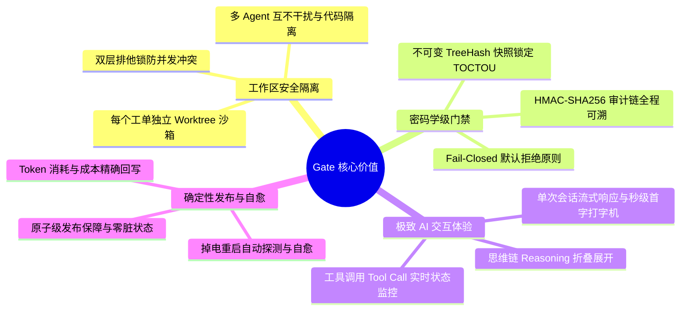
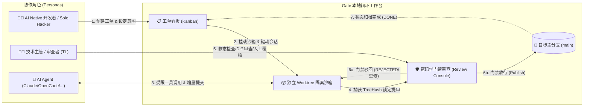
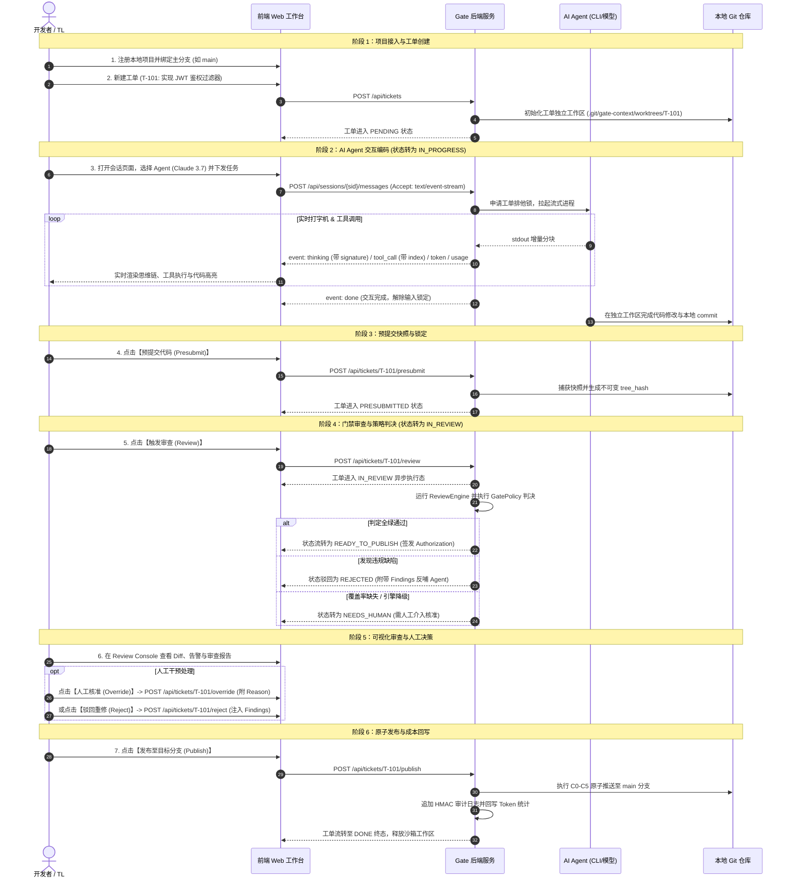
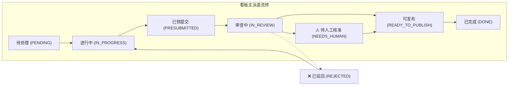

# Local Git Ticket System (Gate) 产品愿景与用户体验规格

> **文档版本**：v2.2-DRAFT  
> **文档状态**：产品目标（Product & UX Target）  
> **面向对象**：产品经理、UI/UX 设计师、前端/后端研发工程师、测试工程师及技术负责人  
> **实现状态说明**：本文描述目标体验，不代表所有能力已经落地；当前能力与生产验收状态以 [`../architecture/production-architecture.md`](../architecture/production-architecture.md) 和代码测试为准。

---

## 1. 产品定位与核心价值主张 (Product Positioning & Value Proposition)

### 1.1 行业痛点与背景
随着 AI 编码智能体（如 Claude Code, OpenCode, Cursor, Aider, Devin）的普及，软件开发模式正在从“人类纯手写代码”向“人类驱动多 Agent 并发开发”发生范式转移。然而，传统研发协作平台（如 GitHub / GitLab / Jira）在面对 AI Agent 时暴露出三大致命断层：
1. **Agent 随意修改污染主分支**：Agent 在本地无节制地执行 `git commit / git push`，缺乏前置确定性的门禁校验，极易引入隐蔽 Bug 与安全漏洞。
2. **工单与代码上下文脱节**：Jira/飞书工单系统与本地 Agent CLI 割裂，开发者需在 Web 界面、终端 CLI 和 IDE 之间反复切换，上下文严重丢失。
3. **缺乏防 TOCTOU 伪造的安全审查**：从 Agent 宣称“开发完成”到人类审查并合并代码之间存在时间窗口（TOCTOU 竞态），期间代码可能被二次修改，传统 PR 机制缺乏密码学级的快照树哈希防篡改凭证。

---

### 1.2 产品定位 (Positioning)
**Local Git Ticket System (Gate)** 是专为 **AI 时代“人机协同 / 多 Agent 协同”** 打造的 **本地优先（Local-First）、Git 原生、强门禁看门与可视化交互工作台**。

```
┌────────────────────────────────────────────────────────────────────────┐
│                        Local Git Ticket System 定位                    │
├───────────────────────────────────┬────────────────────────────────────┤
│ 针对人群 (Target Audience)         │ AI 独立开发者、技术主管 (TL)、AI 研发团队 │
├───────────────────────────────────┼────────────────────────────────────┤
│ 核心场景 (Key Scenarios)          │ 本地工单流转、多 Agent 隔离编码、代码审查门禁 │
├───────────────────────────────────┼────────────────────────────────────┤
│ 核心主张 (Core Proposition)       │ 让 Agent 在沙箱里尽情发挥，让 Gate 守住发布底线 │
└───────────────────────────────────┴────────────────────────────────────┘
```

#### 差异化优势对比 (Gate vs 传统协作方案)

| 评估维度 | 传统协作体系 (Jira / 飞书 + GitHub PR) | Local Git Ticket System (Gate) |
| :--- | :--- | :--- |
| **数据与网络架构** | 中心化云端依赖，离线不可用，网络抖动丢失上下文 | **Local-First & Git 原生**，本地高速响应，离线完整可用 |
| **Agent 执行边界** | Agent 直接在本地主工作区修改，易引发分支污染 | **每个 Ticket 独立 Worktree 沙箱**，物理隔离多 Agent 并发修改 |
| **工单与代码关联** | 靠人工填 PR 链接/分支名关联，上下文容易断层 | **工单即工作区，会话即演进史**，全生命周期强绑定 |
| **防篡改与审查** | 基于分支 HEAD 动态审查，存在 TOCTOU 竞态漏洞 | **不可变 TreeHash 快照签名**，所见即所审、所审即所发 |
| **决策与发布** | 人工 Review 合并，无针对 AI 幻觉的自动化看门 | **门禁规则引擎 (GatePolicy) + Fail-Closed** 自动化与人工兜底并存 |

---

### 1.3 核心价值矩阵 (Value Matrix)



---

## 2. 用户画像与核心角色协作模型 (User Personas & Collaboration)



### 角色职责与 Solo 模式适配：
1. **AI Native 开发者 (Developer)**：
   - **目标**：快速将需求拆解为 Ticket，指派最适合的 Agent（Claude 3.7 Sonnet, DeepSeek-R1, OpenCode 等）在隔离沙箱中编写代码，实时观察 AI 思考过程并快速微调。
2. **技术主管 / 审查者 (Tech Lead / Reviewer)**：
   - **目标**：在代码合入主干前，可视化检查变更 Diff、静态检查报告、覆盖率达标情况，对有争议的代码进行一键驳回或人工强行核准（Manual Override）。
3. **外部 Agent 智能体 (AI Agent)**：
   - **目标**：作为**一级交互公民**，在受限的工作区沙箱内调用文件读写、Bash 执行、Git 预提交等工具，高效完成编码闭环，无法直接越权推送代码至生产分支。
4. **单人独立开发者模式 (Solo Mode)**：
   - 当使用者为 Solo Hacker 时，一人兼任 **开发者** 与 **审查者** 角色。Gate 充当其“第二大脑与质量守门员”，通过自动化的 GatePolicy 门禁与 TreeHash 签名完成自实验证，大幅减少低级失误。

---

## 3. 用户全生命周期使用流程设计 (End-to-End User Journey)

整个系统围绕 **“项目接入 ➔ 工单创建 ➔ Agent 对话 ➔ 预提交快照 ➔ 门禁审查 ➔ 原子发布”** 构成清晰的 6 阶段全流程闭环：



---

## 4. 关键功能模块交互与页面体验设计 (UX & Functional Specs)

### 4.1 项目看板视图 (Ticket Kanban View)
* **核心布局**：
  - **主泳道流转**：`待处理 (PENDING)` $\rightarrow$ `进行中 (IN_PROGRESS)` $\rightarrow$ `已预提交 (PRESUBMITTED)` $\rightarrow$ `审查中 (IN_REVIEW)` $\rightarrow$ `待人工核准 (NEEDS_HUMAN)` $\rightarrow$ `可发布 (READY_TO_PUBLISH)` $\rightarrow$ `已完成 (DONE)`。
  - **驳回与警示**：`REJECTED` 状态卡片自动回流至 `进行中` 泳道，并在卡片顶部打上醒目的红色 `[已驳回: 存在未达标项]` 警示标；`CANCELLED` 归档置于右上角独立折叠抽屉中。
* **卡片视觉层级**：
  - 工单号（`T-101`，等宽字体）、标题、优先级（P0/P1/P2/P3 强调色标签）、绑定的 Agent 徽标、Token 消耗统计、最新 TreeHash 缩略。
* **防错交互**：
  - 支持拖拽流转，若发生跨状态非法拖拽（如跳过预提交直接拖入可发布），系统触发 Tooltip 回弹并提示：`工单必须先完成 Presubmit 与 GatePolicy 门禁审查`。



---

### 4.2 AI 会话编码工作台 (Session Workbench)
* **交互体验原则**：**极简、即时、透明、可控**。
* **页面三大功能区**：
  1. **顶部工单上下文条 (Ticket Context Strip)**：显示关联工单号、目标分支（`main`）、工单状态徽标、一键跳转审查台按钮。
  2. **主聊天与打字机流式视窗**：
     - **实时思维链（Reasoning / Thinking）**：展示 `<ThinkingBlock>`，带动画光标与计时器（`已深度思考 14s`），支持一键折叠/展开，支持展示模型返回的 `signature`。
     - **工具调用卡片（Tool Call Card）**：支持并行多工具调用展示，包含 `index`, `callId`, `toolName`（`git_diff`, `read_file`, `bash`）、执行入参、执行耗时与实时状态（`RUNNING` $\rightarrow$ `SUCCESS` / `FAILED`）。
     - **实时消耗与统计**：每轮交互结束时由 `UsageChunk` 驱动右上角“本轮消耗 / 累计消耗”数值动态累加。
  3. **底部输入与控制底栏**：
     - 支持快捷键 `Enter` 发送、`Shift + Enter` 换行；
     - 运行中展示醒目的 **【中断生成 (Abort)】** 按钮，点击立即切断流并级联强杀底层 Agent 进程，释放工单锁；
     - 具备预设快捷动作：`【开始预提交】`、`【解释当前 Diff】`、`【运行本地单测】`。

---

### 4.3 审查控制台 (Review Console)
* **定位**：代码合并前的最后一道“防盗门”，专为技术主管和审查者设计。
* **核心要素**：
  1. **TreeHash 防 TOCTOU 凭据核验卡片**：
     - 展示预提交 TreeHash 与当前工作区快照 TreeHash 对比；
     - 若一致，绿标显示 `TreeHash 一致 (防 TOCTOU 校验通过)`；
     - 若检测到代码被篡改不一致，触发**全屏黄色警告遮罩并强制锁定发布操作**，引导用户点击 `【重新生成快照预提交】`。
  2. **审查引擎判决大盘 (Engine Verdict Banner)**：
     - 聚合展示静态规则检查、单测覆盖率证明、变更大小（`+124 -32 行`，`4.2 KB`）。
     - 若有违规项，高亮展示违规详情及代码行号。
  3. **分栏 Diff 视图 (Side-by-Side Diff Viewer)**：
     - 清晰展示相对于目标基线（`baseCommit`）的所有文件修改，支持语法高亮。
  4. **决策行动条 (Decision Action Bar)**：
     - 若状态为 `READY_TO_PUBLISH`：高亮展示 **【一键安全发布 (Publish)】** 按钮；
     - 若状态为 `NEEDS_HUMAN`：展示 **【人工核准通过 (Override & Pass)】** 与 **【驳回重修 (Reject)】** 双按钮，并强制要求填写决策原因；
     - 提供 **【带审查意见返回会话】** 快捷按钮，一键将 Findings 违例项转化为 Prompt 注入回 Agent 会话。

---

### 4.4 系统设置与成本大盘 (System Settings & Cost Panel)
1. **Agent 配置中心 (Agent Configs)**：
   - 维护可用的 Agent CLI / 模型配置（名称、CLI 命令、模型标识、自定义系统提示词 System Prompt、额外启动参数 Extra Flags）。
2. **Token 与成本度量大盘 (Cost & Token Telemetry)**：
   - 统计每个工单、每个项目、每个 Agent 的输入/输出 Token 消耗与预估费用；
   - 具备异常超标报警阈值，防止 Agent 进入无限循环死跑空耗费用。

---

## 5. 异常场景与防御性用户体验设计 (Defensive UX & Edge Cases)

| 异常工况场景 | 系统底层行为 | 前端界面与用户体验处理 (Defensive UX) |
| :--- | :--- | :--- |
| **并发争抢冲突** | local 模式使用文件锁；team/enterprise 使用持久化任务租约与 fence，并以 Git/数据库 CAS 保证最终正确性 | 顶部提示当前任务 owner、attempt 和租约状态；界面自动切为只读。管理员只能请求取消或隔离任务，不能通过 Force Unlock 绕过 CAS/fence。 |
| **网络微抖动 / 断连** | Agent 任务默认继续运行并持久化事件；用户显式取消或任务超时才触发终止 | 客户端通过 `Last-Event-ID` 增量回放；若游标过期则读取任务快照。高成本任务可由管理员配置“断开后宽限期取消”策略。 |
| **模型长时间深度思考** | 启动 15s 定时 SSE `: ping` 心跳保活帧 | 界面显示 `思考中 (已耗时 34s)...` 呼吸灯动画，反向代理与网关不发生 60s 读超时断开。 |
| **审查引擎崩溃/超时** | `GatePolicy` 严格执行 Fail-Closed 判定未通过 | 工单自动流转至 `NEEDS_HUMAN`，并在审查大盘提示 `审查引擎响应超时，系统已自动拦截`，提供 `【重试审查 (Retry)】` 与人工核准入口。 |
| **宿主系统意外断电** | `PublishIntent` 停留于 `INIT` 或未决状态 | 重启后访问工单，系统提示 `正在校验发布一致性...`，`ReconcileService` 自动核对 Git 分支并提示自愈完成。 |
